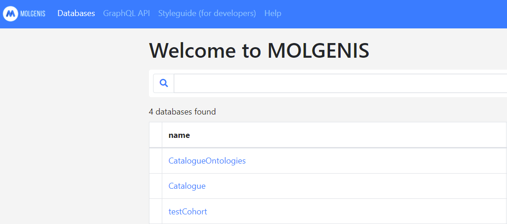
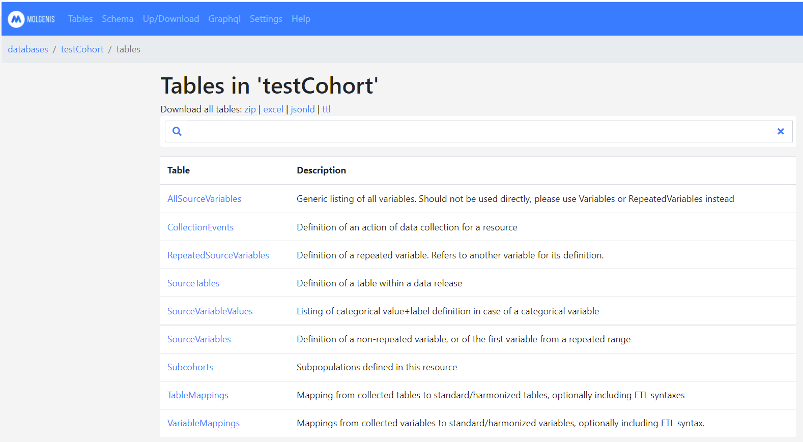
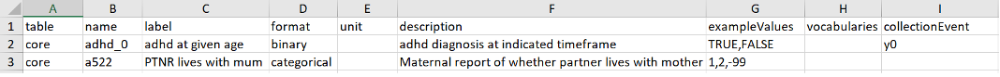
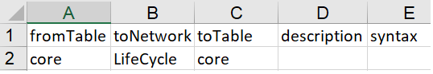
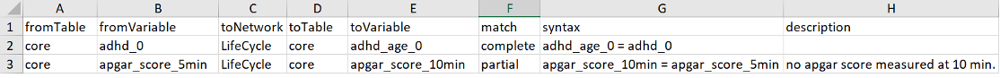
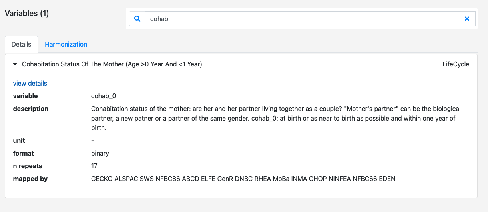
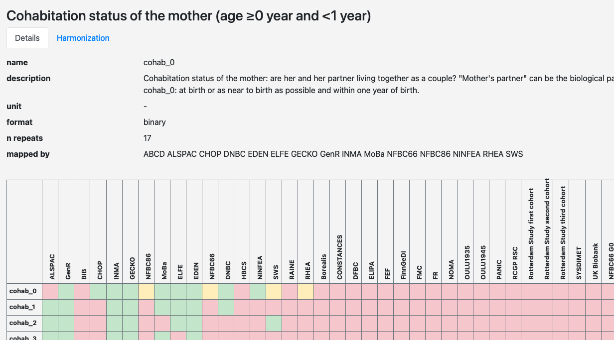
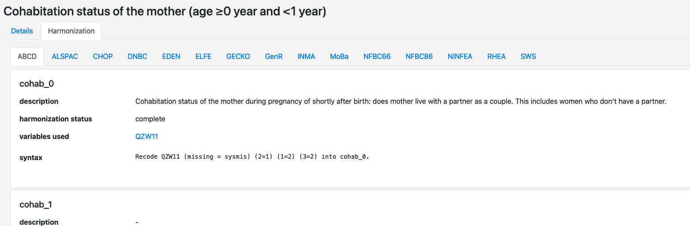

# Data manager of a cohort or data source

## Catalogue

### Data harmonisation

Each organization with access to data (which may be a cohort, or to a data source composed by one or more data banks) harmonises their data according to the consortium’s protocols into a common data model (CDM) format which has been centrally agreed on. In some projects, data may be made available via DataSHIELD. In these cases each resource stores the data locally in [MOLGENIS Armadillo](cat_cohort-data-manager.md#armadillo) DataSHIELD server.

### Staging areas for uploads

The metadata of the cohort or of the data source is uploaded to what are called "staging areas" of the Data Catalogue. You will need credentials to log in and upload metadata.  
LifeCycle, ATHLETE and LongITools use [*data-catalogue-staging*](https://data-catalogue-staging.molgeniscloud.org).  
ConcePTION uses [*emx2-conception*](https://emx2-conception.test.molgenis.org).

When you log in, you will be able to at least see the following databases:  

- Catalogue: The common data models of your consortia, which you need to use in the mappings or ETL.  
- CatalogueOntologies: This database contains the look-up list that you need for filling out some columns in the templates, e.g. format or unit. If you need to add anything to these look-up lists, contact us at [molgenis-support](mailto:molgenis-support@umcg.nl).  
- The database of your own cohort or data source, that you can use to upload the templates once you have filled them out.

*Figure 1. Databases in the Data Catalogue staging area.*

### Define metedata of cohorts or data sources

[MOLGENIS Data Catalogue](https://data-catalogue.molgeniscloud.org/catalogue/catalogue/#/variable-explorer/) provides a framework to describe in detail metadata of cohorts and of data sources, definitions of the variables collected in cohorts and in the data banks composing the data sources (aka 'source variables'), and mappings to common data models (aka 'target variables'). Its purpose is to facilitate pooled data analysis of multiple cohorts together, and multi-data source studies [Gini et al, 2020](https://pubmed.ncbi.nlm.nih.gov/32243569/).

- The metadata of cohorts include descriptive information such as contact details, name of the cohort, and high level summary of contents and cohort design. The metadata of data sources, of the correspending data banks and of the institutions that provide access to them, include descriptive information such as contact details, reason for existence of the data banks, what prompt the records in the data bank, and lag time for updating and accessing data.
- The metadata of the source variables (also known as 'data dictionary') can be considered as a codebook or data dictionary of a cohort (e.g. ALSPAC) and of the tables composing the data banks of data sources (e.g. the Danish Healthcare Registries).
- Similarly, the common data models (or 'target variables') can be considered the codebook of a network of institutions with access to cohorts or data sources (e.g. LifeCycle or ConcePTION)
- The mappings describe how source variables have been converted into target variables as basis for integrated analysis.

This section explains how to submit the 'source variables' + 'mappings from source variables to target variables' into the Data Catalogue. Expected users of this 'how to' are data managers within the institutions with access to cohorts or data sources. This document assumes you have received login details for upload of your metadata. You can also watch this [*instruction video*](https://www.youtube.com/watch?v=b_Ef_Uiw1gE&amp;ab_channel=MOLGENIS).

#### Define source variable metadata / data dictionary

We use the [*Dictionary template*](https://github.com/molgenis/molgenis-emx2/raw/master/docs/resources/Dictionary.xlsx) to define variable metadata. The [*Dictionary template*](https://github.com/molgenis/molgenis-emx2/raw/master/docs/resources/Dictionary.xlsx) consists of multiple sheets. Each sheet corresponds to a table in the Data Catalogue (Figure 1). The columns in the sheet correspond to columns in the table concerned. This document describes how to fill out each of the sheets and their columns. A column with an asterisk (\*) after its name is mandatory, i.e., it should contain values for the system to accept a data upload.

Note that there is no sheet for *AllSourceVariables*. This table is a generic listing of all variables entered for the cohort; it shows *SourceVariables* and *RepeatedVariables* in one table.

It is good practice trying out adding a few variables to the template first and see whether your upload succeeds. To upload the metadata to the Data Catalogue see the section [Upload metadata](cat_cohort-data-manager.md#upload-metadata) to the Data Catalogue.

*Figure 2. Tables in a cohort's or DAP's database in the Data Catalogue.*

#### *SourceTables* sheet

The tables in a cohort or in the data banks of a data source are defined in the *SourceTables* sheet. Columns with an asterisk (\*) after their name are mandatory.

| *Column name* | *Description* |
| --- | --- |
| name \* | Unique table name. |
| label | Table label. |
| description | Table description. |
| unitOfObservation | Defines what each record in this table describes. |
| numberOfRows | Count of the number of records in this table. |

*Table 1. Description of the columns that can be filled out for SourceTables. \* = mandatory*

*Figure 3. Example of SourceTables filled out in Excel.*

#### *SourceVariables* sheet

The variables of the tables specified in the *SourceTables* sheet are defined in the *SourceVariables* sheet.

| *Column name* | *Description* | *Remarks* |
| --- | --- | --- |
| table \* | Table that contains the variable. | Tables must be predefined in the SourceTables sheet. |
| name \* | Variable name, unique within a table. | |
| label | Human readable variable label. | |
| format | The data type of the variable. | Find list to choose from in CatalogueOntologies |
| unit | Unit in case of a continuous or integer format. | Find list to choose from in CatalogueOntologies Units |
| description | Description of the variable. | |
| exampleValues | Examples of values in a comma separated list. | Makes your data more insightful. E.g. 1,2,3 or TRUE,FALSE or 1.23,4.56,3.14 |
| vocabularies | Refer to ontologies being used. | Find list to choose from in CatalogueOntologies Vocabularies |
| collectionEvent | Refer to a collection event. | The collectionEvent needs to be predefined in the _CollectionEvents_ sheet; e.g. y1 or y2 |
| keywords | Enables grouping of variables into topics and helps to display variables in a tree. | Find list to choose from in Catalogue |

*Table 2. Description of the columns that can be filled out for SourceVariables. \* = mandatory*

*Figure 4. Example of SourceVariables filled out in Excel.*

#### *SourceVariableValues* sheet

The coding of categorical variables is defined in the *SourceVariableValues* sheet. This sheet is optional, but it is highly recommended to fill out the codes and values for your categorical variables, so that your data becomes more insightful for those that are interested.

| *Column name* | *Description* | *Remarks* |
| --- | --- | --- |
| variable.table \* | Table that contains the variable. | Tables must be predefined in the _SourceTables_ sheet. |
| variable.name \* | Variable name. | Variables must be predefined in the _SourceVariables_ sheet. |
| value \* | The code or value used. | e.g. 1, 2 or -99 |
| label \* | The label corresponding to the value. | e.g. 'yes', 'no' or 'NA' |
| order | The order in which the code list should appear. | e.g. 1 |
| isMissing | Whether this value indicates a missing field. | TRUE or FALSE |

*Table 3. Description of the columns that can be filled out for SourceVariableValues. \* = mandatory*

*Figure 5. Example of SourceVariableValues filled out in Excel.*

#### *RepeatedSourceVariables* sheet

The *RepeatedSourceVariables* sheet is optional, and is most often used by cohorts whose variables are observed repeatedly. Variables that are repeats of a variable defined in the sheet *SourceVariables* are defined in the *RepeatedSourceVariables* sheet. Defining your repeated variables using this sheet will limit the amount of information that has to be repeated when filling out repeated variables. This sheet is optional.

| *Column name* | *Description* | *Remarks* |
| --- | --- | --- |
| table \* | Table name. | e.g. core |
| name \* | Variable name. | e.g. height\_1 |
| isRepeatOf.table \* | Table that contains the variable that is repeated. | Tables must be predefined in the _SourceTables_ sheet; e.g. core |
| isRepeatOf.name \* | Name of the variable that is repeated. | Variables must be predefined in the _SourceVariables_ sheet; e.g. height\_0 |
| collectionEvent | Refer to a collection event. | The collectionEvent needs to be predefined in the _CollectionEvents_ sheet; e.g. y1 or y2 |

*Table 4. Description of the columns that can be filled out for RepeatedSourceVariables. \* = mandatory*

*Figure 6. Example of RepeatedSourceVariables filled out in Excel.*

#### *CollectionEvents* sheet

The *CollectionEvents* sheet is optional, and is most often used by cohorts. The timing of data collection in events is defined in the *CollectionEvents* sheet. It can be used to describe time periods within which the data for variables are collected. The events are defined here and referred to from the sheets *SourceVariables* and/or *RepeatedSourceVariables*.

| *Column name* | *Description* | *Remarks* |
| --- | --- | --- |
| name \* | Name of the collection event. | e.g. y9 |
| description | Event description. | e.g. Between 9 and 10 years. |
| ageGroups | The age groups that were sampled within this collection event. | Find list to choose from in CatalogueOntologies  (AgeGroups) |
| subcohorts | (sub)populations that are targeted with this collection event | e.g. women or children |

*Table 5. Description of the columns that can be filled out for SourceCollectionEvents. \* = mandatory*

*Figure 7. Example of CollectionEvents filled out in Excel.*

#### *Subcohorts* sheet

The sheet *Subcohorts* is optional, and is most often used by cohorts. Here you may describe populations that can be linked to collection events.

| *Column name* | *Description* | *Remarks* |
| --- | --- | --- |
| name \* | Name of the subpopulation. | e.g. mothers or children |
| description | Subpopulation description | |

*Table 6. Description of the columns that can be filled out for Subpopulations. \* = mandatory*

*Figure 8. Example of Subcohorts filled out in Excel.*

#### Define harmonisations

We use the [*Mappings* template*](https://github.com/molgenis/molgenis-emx2/raw/master/docs/resources/Mappings.xlsx) to describe the harmonisations. The [*Mappings* template*](https://github.com/molgenis/molgenis-emx2/raw/master/docs/resources/Mappings.xlsx) consists of two sheets (TableMappings and VariableMappings). It is used to define the mappings from source variables to target variables, or the Extraction, Transformation and Load (ETL) process from a data source to a common data model (CDM).

#### *TableMappings* sheet

Harmonisation procedures at the table level are defined in the *TableMappings* sheet, irrespective of whether the table is in a cohort or in a data bank.

| *Column name* | *Description* | *Remarks* |
| --- | --- | --- |
| fromTable \* | Source table name. | Tables must be predefined in the *SourceTables* sheet. |
| toNetwork \* | Name of the target network or common data model. | e.g. LifeCycle, LongITools or ATHLETE or ConcePTION_WP7 |
| toTable \* | Target table name. | Map to a table that is defined in a common data model. |
| description | Description of the harmonisation. | |
| syntax | Syntax used for this harmonisation. | |

*Table 7. Description of the columns that can be filled out for VariableMappings. \* = mandatory

*Figure 9. Example of TableMappings filled out in Excel.*

#### *VariableMappings* sheet

Harmonisation procedures at the variable level are defined in the *VariableMappings* sheet.

| *Column name* | *Description* | *Remarks* |
| --- | --- | --- |
| fromTable \* | Source table name. | Tables must be predefined in the *SourceTables* sheet. |
| fromVariable | Source variable name(s). | Variables must be predefined in the _SourceVariables_ sheet. When multiple variables are mapped together use a comma-separated list, e.g. v\_1,v\_2,v\_3. |
| toNetwork \* | Name of the target network or common data model.  | e.g. LifeCycle, LONGITOOLS or ATHLETE |
| toTable \* | Target table name. | Map to a table that is defined in a common data model. |
| toVariable \* | Target variable name. | Map to a variable that is defined in a common data model. |
| match | Whether the harmonisation is partial, complete or NA (non-existent). | Find list to choose from in CatalogueOntologies (StatusDetails) |
| description | Description of the harmonisation. | |
| syntax | Syntax used for this harmonisation. | |

*Table 8. Description of the columns that can be filled out for VariableMappings. \* = mandatory

*Figure 10. Example of VariableMappings filled out in Excel.*

### Upload metadata

When you filled out the template(s) you can start uploading the metadata. When you log in to MOLGENIS Data Catalogue you will see a listing of databases that are accessible to you. Click on your cohort's database to access it. Move to 'Up/Download' via the menu. Use 'browse' to select a template and 'upload' to start uploading your data. You can now view your data under 'Tables'.

Please report any bugs or difficulties to [molgenis-support](mailto:molgenis-support@umcg.nl).

#### Find harmonisations

When your data is uploaded to the Data Catalogue you can find your own harmonised variables in variable details.

Use the search bar to find your variable(s) of interest.

Click on "variable details"

Click on "Harmonization"

#### Request access (catalogue)

If you do not have an account to upload data to the Data Catalogue yet, please email [molgenis-support](mailto:molgenis-support@umcg.nl) to apply for an account.

## Armadillo

Upload harmonised data into a local Armadillo/Opal instance in order to make it available for DataSHIELD to run analyses. Note that MOLGENIS Data Catalogue does not communicate or have access to any data stored in Armadillo/Opal.

### Request access (Armadillo)

The Armadillo works with a central authentication service. This means to work with the Armadillo you need to have an account on the central authentication service. To acquire an account please follow instructions on [this video](https://youtu.be/Gj0uANX8nIw).

### Initial upload
There are two phases to uploading data to the Armadillo. The initial upload transforms your source data to the right format for analysis. Besides this you can perform some data manipulation on the initially uploaded data.

The initial upload can be done with the [dsUpload](https://lifecycle-project.github.io/ds-upload).

### Create subsets

To manipulate the data after the initial upload you can use the [MolgenisArmadillo](https://molgenis.github.io/molgenis-r-armadillo) client.
You can use the [MolgenisArmadillo](https://molgenis.github.io/molgenis-r-armadillo) to create data subsets. Check the [documentation](https://molgenis.github.io/molgenis-r-armadillo/articles/creating_data_subsets.html) to create subsets.

### Assign permissions

After the correct authentication and authorisation steps have been set up, researchers will be able to analyse the cohort’s data via DataSHIELD. We use the authentication service to give people permission to analyse the data. There are several steps you need to perform to give people access:

- create a role
- register a user
- give a user a role

We assume you have already created the necessary data sets for the researcher in question. After that you can navigate to the authentication service of the Armadillo. This [manual](https://molgenis.github.io/molgenis-js-auth) describes how to assign permissions to researchers.

### Quality control

There are two levels of quality control, central and local. You can perform local quality control yourself. This is done on the dataset you harmonised for the project. Usually the local quality control scripts are developed and distributed in the harmonisation manual.

For central quality control we use the [dsUpload](https://lifecycle-project.github.io/ds-upload/articles/qualityControl.html) package. We are now developing quality control measures for the different variables. Continues, repeated etc. This is not finished yet. We will let you know when this is useable.

### Deploy an instance

To get the Armadillo installed at your institute you need to contact your IT-department and send the [installation manual](https://galaxy.ansible.com/molgenis/armadillo).

The system administrator needs to have specific information to set up the Armadillo. Each Armadillo is bound to a central authentication server. There needs to be an entry in this central authentication server for the Armadillo. You can email [*molgenis-support*](mailto:molgenis-support@umcg.nl) to get the specific information that applies to your Armadillo instance.
