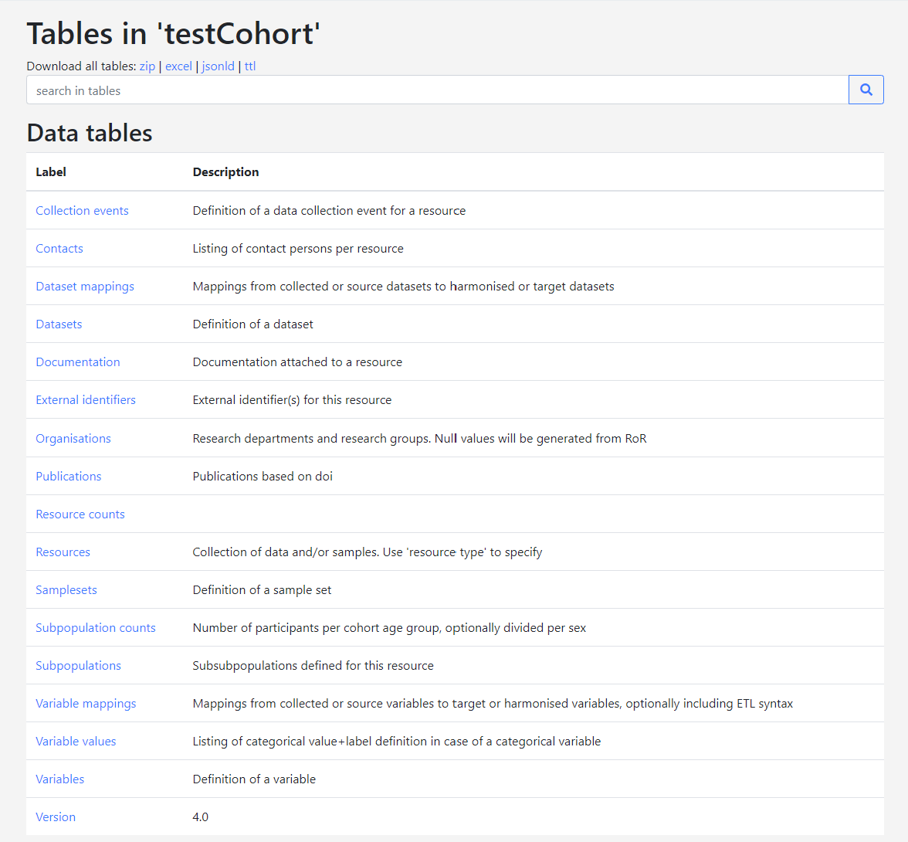

# Cohort data manager
## Catalogue
### Data harmonisation
Each cohort harmonises the data according to the consortium’s harmonisation protocols into the CDM format which has been centrally agreed on and stores the data locally, not in MOLGENIS catalogue.
#### Describe and upload cohort variable metadata
MOLGENIS Data Catalogue provides a framework to describe in detail cohort metadata, description of the data variables collected (aka 'source variables'), and mappings to common data models (aka 'target variables'). Its purpose is to facilitate pooled data analysis of multiple cohorts together.

- The cohort metadata provides descriptive information such as contact details, name of the cohort, and high level summary of contents and cohort design.
- The variable metadata (or 'source variables') can be considered as a codebook or data dictionary of a cohort (e.g. ALSPAC).
- Similarly, the common data model metadata (or 'target variables') can be considered the codebook of a network of cohorts working together (e.g. LifeCycle)
- The mappings describe how source variables have been converted into target variables as basis for integrated analysis.

This document explains how to submit the 'source variables' + 'mappings from source variables to target variables' into the Data Catalogue. Expected users of this 'how to' are data managers within the cohorts. This document assumes you have received login details for upload of your cohort.

#### Define variable metadata using the *CohortDictionary* template

The *CohortDictionary template* consists of multiple sheets. Each sheet corresponds to a table in the Data Catalogue (Figure 1).The columns in the sheet correspond to columns in the table concerned. This document describes how to fill out each of the sheets and their columns. A column with an asterisk (\*) after its name is mandatory, i.e., it should contain values for the system to accept a data upload. Note that there is no sheet for *AllSourceVariables*. This table is a generic listing of all variables entered for the cohort; it shows *SourceVariables_ and *RepeatedVariables* in one table.

It is good practice to try out adding a few variables to the template first and see whether your upload succeeds. To upload the metadata to the Data Catalogue see the section [*upload template*](https://github.com/molgenis/molgenis-emx2/blob/master/docs/resources/CohortDictionary.xlsx) to the [*Data Catalogue*](https://data-catalogue-staging.molgeniscloud.org).

*Figure 1. Tables in a cohorts' database in the Data Catalogue.*

#### *SourceTables* sheet
The cohort tables are defined in the *SourceTables* sheet. Columns with an asterisk (\*) after their name are mandatory.

| *Column name* | *Description* |
| --- | --- |
| name \* | Unique table name. |
| label | Table label. |
| description | Table description. |

*Table 1. Description of the columns that can be filled out for SourceTables. \* = mandatory*

*Figure 2. Example of SourceTables filled out in Excel.*

#### *SourceVariables* sheet

The cohort variables are defined in the *SourceVariables* sheet.

| *Column name* | *Description* | *Remarks* |
| --- | --- | --- |
| table \* | Table that contains the variable. | Tables must be predefined in the SourceTables sheet. |
| name \* | Variable name, unique within a table. | |
| label | Human readable variable label. | |
| format | The data type of the variable. | Find list to choose from in CatalogueOntologies \&gt; Formats |
| unit | Unit in case of a continuous or integer format. | Find list to choose from in CatalogueOntologies \&gt; Units |
| description | Description of the variable. | |
| exampleValues | Examples of values in a comma separated list. | Makes your data more insightful. E.g. 1,2,3 or TRUE,FALSE or 1.23,4.56,3.14 |
| vocabularies | Refer to ontologies being used. | Find list to choose from in CatalogueOntologies \&gt; Vocabularies |
| collectionEvent | Refer to a collection event. | The collectionEvent needs to be predefined in the _CollectionEvents_ sheet; e.g. y1 or y2 |
| keywords | Enables grouping of variables into topics and helps to display variables in a tree. | Find list to choose from in Catalogue \&gt; Keywords |

*Table 2. Description of the columns that can be filled out for SourceVariables. \* = mandatory*

*Figure 3. Example of SourceVariables filled out in Excel.*

#### *SourceVariableValues* sheet

The coding of categorical variables is defined in the *SourceVariableValues* sheet. This sheet is optional, but it is highly recommended to fill out the codes and values for your categorical variables, so that your data becomes more insightful for those that are interested.

| *Column name* | *Description* | *Remarks* |
| --- | --- | --- |
| variable.table \* | Table that contains the variable. | Tables must be predefined in the _SourceTables_ sheet. |
| variable.name \* | Variable name. | Variables must be predefined in the _SourceVariables_ sheet. |
| value \* | The code or value used. | e.g. 1, 2 or -99 |
| label \* | The label corresponding to the value. | e.g. 'yes', 'no' or 'NA' |
| order | The order in which the code list should appear. | e.g. 1 |
| isMissing | Whether this value indicates a missing field. | TRUE or FALSE |

*Table 3. Description of the columns that can be filled out for SourceVariableValues. \* = mandatory*

*Figure 4. Example of SourceVariableValues filled out in Excel.*

#### *RepeatedSourceVariables* sheet

The *RepeatedSourceVariables* sheet is optional.Variables that are repeats of a variable defined in the sheet *SourceVariables* are defined in the *RepeatedSourceVariables* sheet. Defining your repeated variables using this sheet will limit the amount of information that has to be repeated when filling out repeated variables. This sheet is optional.

| *Column name* | *Description* | *Remarks* |
| --- | --- | --- |
| table \* | Table name. | e.g. core |
| name \* | Variable name. | e.g. height\_1 |
| isRepeatOf.table \* | Table that contains the variable that is repeated. | Tables must be predefined in the _SourceTables_ sheet; e.g. core |
| isRepeatOf.name \* | Name of the variable that is repeated. | Variables must be predefined in the _SourceVariables_ sheet; e.g. height\_0 |
| collectionEvent | Refer to a collection event. | The collectionEvent needs to be predefined in the _CollectionEvents_ sheet; e.g. y1 or y2 |

*Table 4. Description of the columns that can be filled out for RepeatedSourceVariables. \* = mandatory*

*Figure 5. Example of RepeatedSourceVariables filled out in Excel.*

#### *CollectionEvents* sheet
The *CollectionEvents* sheet is optional. The timing of data collection in events is defined in the *CollectionEvents* sheet. It can be used to describe time periods within which the data for variables are collected. The events are defined here and referred to from the sheets *SourceVariables* and/or *RepeatedSourceVariables*.

| *Column name* | *Description* | *Remarks* |
| --- | --- | --- |
| name \* | Name of the collection event. | e.g. y9 |
| description | Event description. | e.g. Between 9 and 10 years. |
| ageMin | The minimum age for this collection event. | Find list to choose from in CatalogueOntologies \&gt; AgeCategories |
| ageMax | The maximum age for this collection event. | Find list to choose from in CatalogueOntologies \&gt; AgeCategories |
| subcohorts | (sub)populations that are targeted with this collection event
 | e.g. women or children |

*Table 5. Description of the columns that can be filled out for SourceCollectionEvents. \* = mandatory*

*Figure 6. Example of CollectionEvents filled out in Excel.*

#### *Subcohorts* sheet
The sheet *Subcohorts* is optional. Here you may describe populations that can be linked to collection events.

| *Column name* | *Description* | *Remarks* |
| --- | --- | --- |
| name \* | Name of the subpopulation. | e.g. mothers or children |
| description | Subpopulation description | |

*Table 6. Description of the columns that can be filled out for Subpopulations. \* = mandatory*

*Figure 7. Example of Subpopulations filled out in Excel.*

#### Define variable harmonizations using the _CohortMappings_ template
The *CohortMappings* [*upload template*](https://github.com/molgenis/molgenis-emx2/blob/master/docs/resources/CohortMappings.xlsx) consists of one sheet. It is used to define the mappings from source variables to target variables.

#### *VariableMappings* sheet
Harmonization procedures at the variable level are defined in the *VariableMappings* sheet.

| *Column name* | *Description* | *Remarks* |
| --- | --- | --- |
| fromTable \* | Source table name. | Tables must be predefined in the *SourceTables* sheet. |
| fromVariable | Source variable name(s). | Variables must be predefined in the _SourceVariables_ sheet. When multiple variables are mapped together use a comma-separated list, e.g. v\_1,v\_2,v\_3. |
| toNetwork \* | Network name that contains the variable to map to. | e.g. LifeCycle or LONGITOOLS or ATHLETE |
| toTable \* | Target table name. | Map to a table that is defined in a common data model. |
| toVariable \* | Target variable name. | Map to a variable that is defined in a common data model. |
| match | Whether the harmonization is partial, complete or NA (non-existent). | Find list to choose from in CatalogueOntologies \&gt; StatusDetails |
| description | Description of the harmonization. | |
| syntax | Syntax used for this harmonization. | |

*Table 7. Description of the columns that can be filled out for VariableMappings. \* = mandatory

*Figure 8. Example of VariableMappings filled out in Excel.*

#### Upload cohort metadata descriptions

When you log in to MOLGENIS Data Catalogue you will see a listing of databases that are accessible to you. Click on your cohort's database to access it. Move to 'Up/Download' via the menu. Use 'browse' to select a template and 'upload' to start uploading your data. You can now view your data under 'Tables'.

Please report any bugs or difficulties to [molgenis-support@umcg.nl](mailto:molgenis-support@umcg.nl).
### Cohort metadata description
Each cohort decides how each of its variables (original cohort data) is harmonised to the CDM and uploads this information as a source data model into the MOLGENIS catalogue (harmonise the data). For every variable the following syntax needs to be described for harmonisation: attributes, data type, description (harmonised set).
### Find harmonisation specifications
If you uploaded the data into the catalogue you can find your own harmonised variables in variable details.

Search on the variable you want to see.

Click on "variable details"

Click on "Harmonizations"

#### Request access
If you do not have an account on the catalogue yet, please email [molgenis-support](mailto:molgenis-support@umcg.nl) to apply for an account.

## Armadillo
Upload harmonized data into a local Armadillo/Opal instance in order to make it available for DataSHIELD to run analysis. Note that MOLGENIS catalogue does not communicate or has access to any data stored in Armadillo/Opal.
### Initial data upload
There are 2 phases in uploading the data to the Armadillo. You have the initial upload which transform your source data to the right format for the analysis Besides this you have the data manipulation on the initially uploaded data. 

The initial upload can be done with the [dsUpload](https://lifecycle-project.github.io/ds-upload).
### Create subsets of the data
To manipulate the data after the initial upload you can use the [MolgenisArmadillo](https://molgenis.github.io/molgenis-r-armadillo) client.
In the [MolgenisArmadillo](https://molgenis.github.io/molgenis-r-armadillo) you can create subsets for the data as well. Check the [documentation](https://molgenis.github.io/molgenis-r-armadillo/articles/creating_data_subsets.html) to create the subsets.

### Give permissions on the data
After the correct authentication and authorization steps have been set up researchers will be able to analyse the cohort’s data via DataSHIELD. We use the authentication service to give people permission to the data. There are several steps you need to perform to give people access to the data.

- create a role
- register a user
- give a user a role

We assume you have already created the necessary data sets for the researcher in question. After that you can navigate to the authentication service of the Armadillo. In the [manual](https://molgenis.github.io/molgenis-js-auth) is described how to assign permissions to researchers.

### Quality control
There are 2 levels of quality control, central and local. Local quality control you can perform yourself. This is done on the dataset you harmonised for the project. Useually the local quality control scripts are developed and distributed in the harmonisation manual. You can find them there. 

For the central quality control we use the [dsUpload](https://lifecycle-project.github.io/ds-upload/articles/qualityControl.html) package. We are now developing quality control measures for the different variables. Continues, repeated etc. This is not finished yet. We will let you know when this is useable.

### Request permissions

After the correct authentication and authorization steps have been set up researchers will be able to analyse the cohort’s data via DataSHIELD.