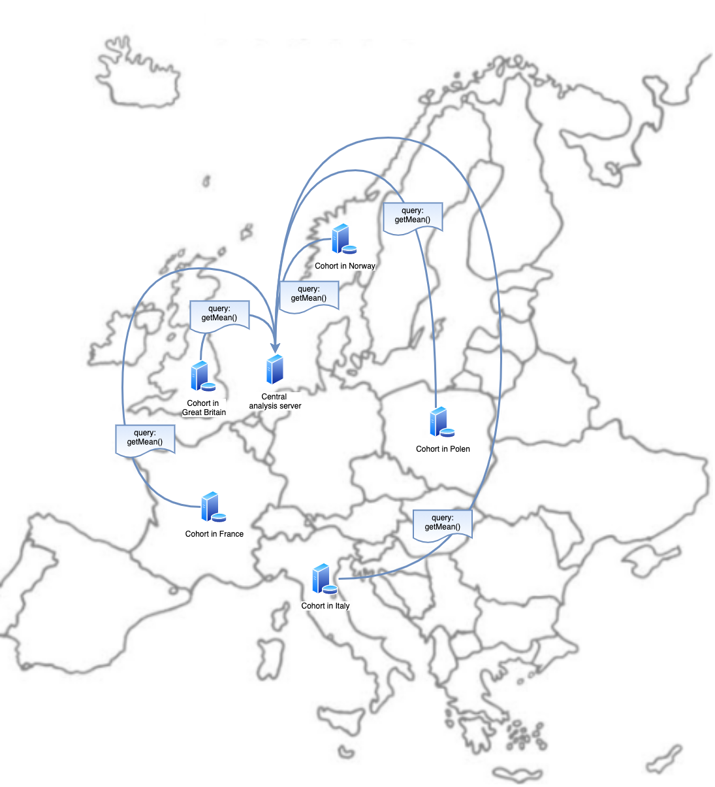

# General information

We facilitate federated analysis. Federated analysis allows researchers to carry out analysis over data in multiple cohorts a) without having access to individual data and b) without individual data needing to leave the cohort. Federated analysis allows GDPR-proof research.

To **find** the data we developed a [catalogue](https://data-catalogue.molgeniscloud.org/catalogue/catalogue/#/variable-explorer/). Here you can find the metadata of the cohorts and the common data model.

We distinguish three roles within each federated network.

|     |     | [Researcher](cat_researcher.md) | [Cohort data manager](cat_cohort-data-manager.md) | [Network data manager](cat_network-data-manager.md) |
| --- | --- | --- | --- | --- |
| Catalogue | Data harmonisation | | [X](cat_cohort-data-manager.md#data-harmonisation) | |
| Catalogue | Cohort metadata description | | [X](cat_cohort-data-manager.md#define-metedata-of-cohorts-or-data-sources) | |
| Catalogue | Describe and upload common data model | | | [X](cat_network-data-manager.md#define-cdm-metadata) |
| Catalogue | Find (harmonised) variables | [X](cat_researcher.md#find-variables) | | |
| Catalogue | Find harmonisation specifications | [X](cat_researcher.md#find-harmonisation-details) | [X](cat_cohort-data-manager.md#define-harmonisations) | |
| Catalogue | Request access | | [X](cat_cohort-data-manager.md#request-access-catalogue) | [X](cat_network-data-manager.md#request-access) |
