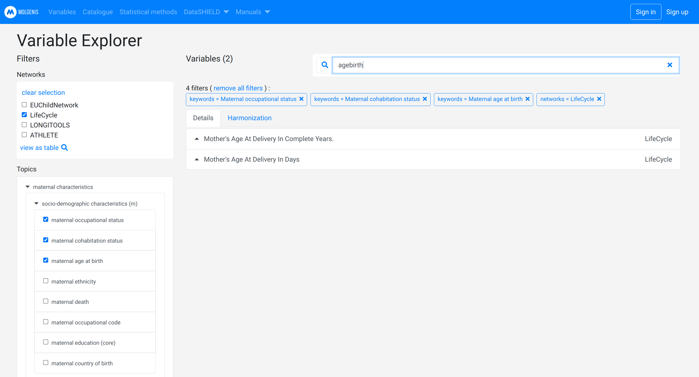
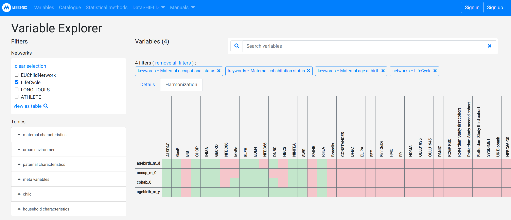
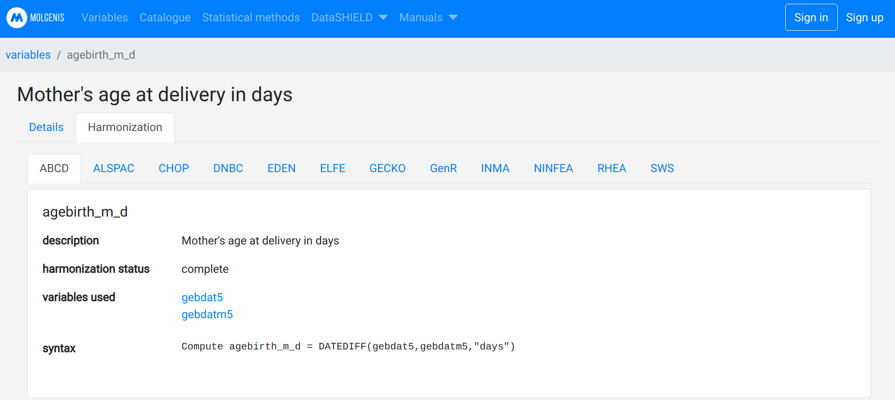

# Researcher

## Catalogue

When you have defined a research question it is time to find the relevant variables to answer it. You can use the [MOLGENIS Data Catalogue](https://data-catalogue.molgeniscloud.org/catalogue/catalogue/#/) to compose your dataset. The Data Catalogue only describes the variables, it does **not** contain the actual data values.

### Find variables

You can use the filters and search bar to subset variables. In the example below, four filters are used, one network filter and three topic filters.

You can search on variables (for example: `agebirth`) with filters already set in place.

*In the future you will be able to use the shopping cart to select all variables of interest and create an overview.*

### Find harmonisation details

The harmonisation view allows you to see which cohorts have (partially) harmonised your variable of interest and thus have that variable available for analysis.

You can view how a specific cohort has harmonised a specific variable.

