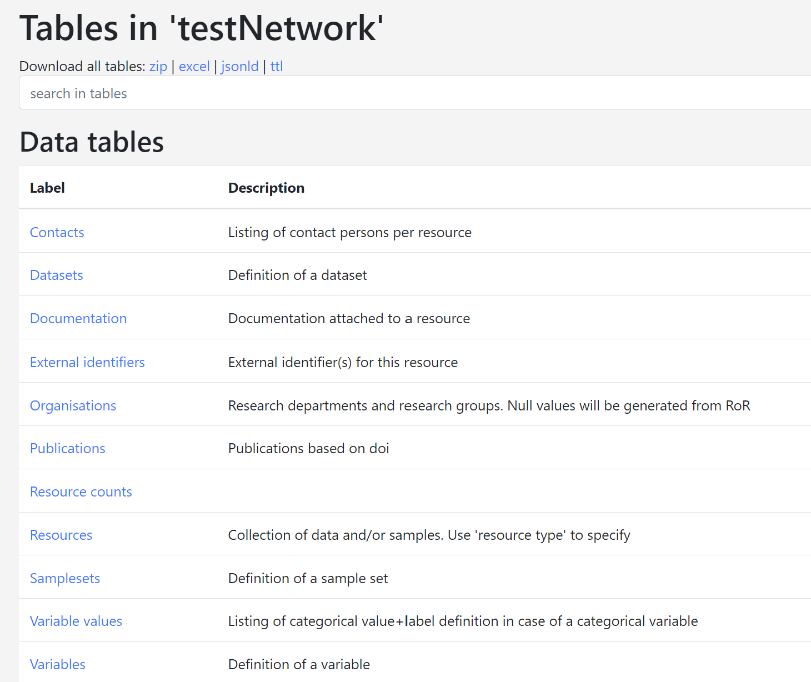

# CDM / Network data manager

The Network data manager is responsible for uploading the common data model (CDM) to the Data Catalogue.

## Catalogue

### Define CDM metadata

[MOLGENIS Data Catalogue](https://data-catalogue.molgeniscloud.org/catalogue/catalogue/#/variable-explorer/) (sometimes
also called 'EMX2 catalogue') provides a framework to describe in detail: cohort metadata; definitions of the data
variables collected (aka 'source variables'); and mappings to common data models (aka 'target variables). Its purpose is
to facilitate pooled data analysis of multiple cohorts.

- The cohort metadata provides descriptive information such as contact details, name of the cohort, and high-level
  summary of contents and cohort design.
- The variable metadata (or 'source variables') can be considered as a codebook or data dictionary for a cohort (e.g.
  ALSPAC).
- Similarly, the common data model metadata (or 'target variables') can be considered the codebook for a network of
  cohorts working together (e.g. LifeCycle)
- The mappings describe how source variables have been converted into target variables as basis for integrated analysis.

This section explains how to submit the 'target variables' (also called the harmonised model or common data model) into
the Data Catalogue. Expected users of this 'how to' are central data managers of networks such as LifeCycle or
LongITools. You will need login details to upload metadata to MOLGENIS Data Catalogue.

#### Define common data elements

We use the [*TargetDictionary* template](https://github.com/molgenis/molgenis-emx2/raw/master/docs/resources/TargetDictionary.xlsx)
to describe the common data model elements. The 
[*TargetDictionary* template](https://github.com/molgenis/molgenis-emx2/raw/master/docs/resources/TargetDictionary.xlsx)
consists of multiple sheets. Each sheet corresponds to a table in the Data Catalogue. The columns in the sheet
correspond to columns in the table concerned. This document describes how to fill out each of the sheets and their
columns. A column with an asterisk (\*) after its name is mandatory, i.e., it should contain values for the system to
accept a data upload. You can download this
[*filled out example*](https://github.com/molgenis/molgenis-emx2/raw/master/docs/resources/TargetDictionary_testCDM.xlsx)
as a reference for filling out the template.

 Note that there is no sheet for *AllTargetVariables*. This table is a generic listing of all
variables entered for the cohort; it shows *TargetVariables* and *RepeatedTargetVariables* in one table.

It is good practice to try adding a few variables to the template first and see whether your upload succeeds. To
upload the metadata to the Data Catalogue see the section To upload the metadata to the Data Catalogue see the
section [Upload metadata](cat_network-data-manager.md#upload-metadata) to the Data Catalogue.

Figure 1. Tables in a Network’s staging area in the Data Catalogue.

#### *TargetDataDictionaries* sheet

Versioning of the network's data model is defined in the *TargetDataDictionaries* sheet. Columns with an asterisk (\*) 
after their name are mandatory.

| *Column name* | *Description* | *Remarks* |
| --- | --- | --- |
| resource \* | Name of the network's model | e.g LifeCycle_CDM, LongITools_CDM or ATHLETE_CDM |
| version \* | Version of the target data dictionary | e.g. 1.1 |

Table 1. Description of the columns that can be filled out for TargetDataDictionaries. * = mandatory

#### *TargetTables* sheet

The cohort tables are defined in the *SourceTables* sheet. Columns with an asterisk (\*) after their name are mandatory.

| *Column name* | *Description* | *Remarks* |
| --- | --- | --- |
| dataDictionary.resource \* | Name of the model. | e.g LifeCycle_CDM, LongITools_CDM or ATHLETE_CDM |
| dataDictionary.version \* | Target data dictionary version this table is part of. | e.g. 1.0.1 |
| name \* | Unique table name | |
| label | Table label | |
| description | Table description | |

Table 2. Description of the columns that can be filled out for TargetTables. * = mandatory

#### *TargetVariables* sheet

The cohort variables are defined in the *TargetVariables* sheet.

| *Column name* | *Description* | *Remarks* |
| --- | --- | --- |
| dataDictionary.resource \* | Name of the model that contains this variable | e.g LifeCycle_CDM, LongITools_CDM or ATHLETE_CDM |
| dataDictionary.version \* | Target data dictionary version this variable is part of | e.g. 1.0.1 |
| table \* | Table that contains the variable | Tables must be predefined in the TargetTables sheet |
| name \* | Variable name, unique within a table | |
| label | Human readable variable label | |
| format | The data type of the variable | Find list to choose from in CatalogueOntologies |
| unit1 | Unit in case of a continuous or integer format | Find list to choose from in CatalogueOntologies |
| description | Description of the variable | |
| keywords1 | Enables grouping of variables into topics and displaying in a tree | Find list to choose from in CatalogueOntologies  |
| exampleValues | Examples of values in a comma separated list | Makes your data more insightful; e.g. 1,2,3 or TRUE,FALSE or 1.23,4.56,3.14 |
| mandatory | Whether this variable is required within this collection | |
| vocabularies1 | Refer to ontologies being used | Find list to choose from in CatalogueOntologies e.g. ICD10 |
| collectionEvent.resource | Refer to the resource that contains the collectionEvent | e.g. LifeCycle |
| collectionEvent.name | Refer to a collection event | e.g. y1 or y2 |

Table 3. Description of the columns that can be filled out for TargetVariables. * = mandatory;
1contact [*molgenis-support@umcg.nl*](mailto:molgenis-support@umcg.nl) to add Vocabularies, Keywords or Units

#### *TargetVariableValues* sheet

The coding of categorical variables is defined in the *TargetVariableValues* sheet. This sheet is optional, but it is
highly recommended to fill out the codes and values for your categorical variables, so that your data becomes more
insightful for those that are interested.

| *Column name* | *Description* | *Remarks* |
| --- | --- | --- |
| dataDictionary.resource \* | Name of the model that contains this variable | e.g LifeCycle_CDM |
| dataDictionary.version \* | Target data dictionary version this variable is part of | e.g. 1.0.1 |
| variable.table \* | Table that contains the variable | Tables must be predefined in the TargetTables sheet |
| variable.name \* | Variable name | Variables must be predefined in the TargetVariables sheet |
| value \* | The code or value used | e.g. 1, 2 or -99 |
| label \* | The label corresponding to the value | e.g. 'yes', 'no' or 'NA' |
| order | The order in which the code list should appear | e.g. 1 |
| isMissing | Whether this value indicates a missing field | TRUE or FALSE |
| ontologyTermIRI | Reference to an ontology term that defines this categorical value | e.g. [http://purl.obolibrary.org/obo/DOID\_1094](http://purl.obolibrary.org/obo/DOID\_1094) |

Table 4. Description of the columns that can be filled out for TargetVariableValues. * = mandatory

#### *RepeatedTargetVariables* sheet

The *RepeatedTargetVariables* sheet is optional. Variables that are repeats of a variable defined in the sheet _
TargetVariables_ are defined in the *RepeatedTargetVariables* sheet. Defining your repeated variables using this sheet
will limit the amount of information that has to be repeated when filling out repeated variables. This sheet is
optional.

| *Column name* | *Description* | *Remarks* |
| --- | --- | --- |
| dataDictionary.resource \* | Name of the model that contains this variable | e.g LifeCycle_CDM or ATHLETE_CDM |
| dataDictionary.version \* | Target data dictionary version this variable is part of | e.g. 1.0.1 |
| table \* | Table name | e.g. core |
| name \* | Variable name | e.g. height\_1 |
| isRepeatOf.table \* | Table that contains the variable that is repeated | Tables must be predefined in the _TargetTables_ sheet; e.g. core |
| isRepeatOf.name \* | Name of the variable that is repeated | Variables must be predefined in the _TargetVariables_ sheet; e.g. height\_0 |
| collectionEvent.resource | Refer to the network that contains the collection event | e.g. LifeCycle |
| collectionEvent.name | Refer to the name of a collection event | The collectionEvent needs to be predefined in the *CollectionEvents* sheet; e.g. y1 or y2 |

Table 5. Description of the columns that can be filled out for RepeatedTargetVariables. * = mandatory

#### *CollectionEvents* sheet

The *CollectionEvents* sheet is optional. The timing of data collection in events is defined in the *CollectionEvents*
sheet. It can be used to describe time periods within which the data for variables are collected. The events are defined
here and referred to from the sheets *TargetVariables* and/or *RepeatedTargetVariables*.

| *Column name* | *Description* | *Remarks* |
| --- | --- | --- |
| resource \* | Name of the model that contains this collection event | e.g LifeCycle_CDM |
| name \* | Name of the collection event | e.g. y9 |
| description | Event description | e.g. Between 9 and 10 years |
| ageGroups | The age groups that were sampled within this collection event | Find list to choose from in CatalogueOntologies (AgeGroups) |
| subcohorts | Subcohorts or subpopulations that are targeted with this variable | Subcohorts need to be predefined in the _Subcohorts_ sheet |

Table 6. Description of the columns that can be filled out for CollectionEvents. * = mandatory

#### *Subcohorts* sheet

The sheet *Subcohorts* is optional. Here you may describe populations that can be linked to collection events.

| *Column name* | *Description* | *Remarks* |
| --- | --- | --- |
| resource | Name of the model that contains this subcohort | e.g LifeCycle_CDM |
| name \* | Name of the subpopulation or subcohort | e.g. mothers or children |
| description | Subpopulation description | |

Table 7. Description of the columns that can be filled out for Subpopulations. * = mandatory

### Request access

Send an email to [*molgenis-support@umcg.nl*](mailto:molgenis-support@umcg.nl) to apply for an account to upload metadata to
the Data Catalogue.

### Upload metadata

When you log in to MOLGENIS Data Catalogue you will see a listing of databases that are accessible to you. Click on your
network's database to access it. Go to 'Up/Download' in the menu. Use 'browse' to select a template and 'upload' to
start uploading your metadata. After uploading you can view your metadata under 'Tables'.
