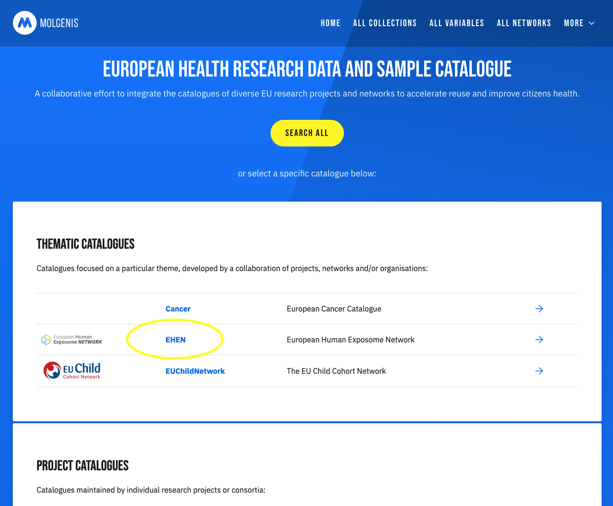
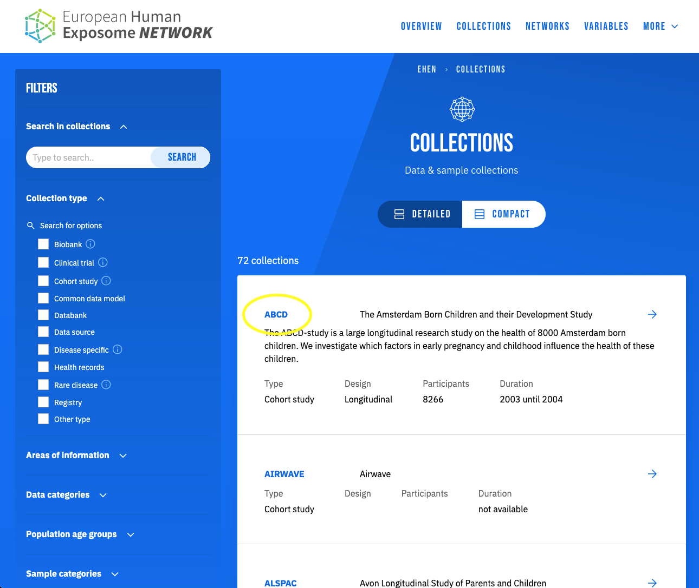
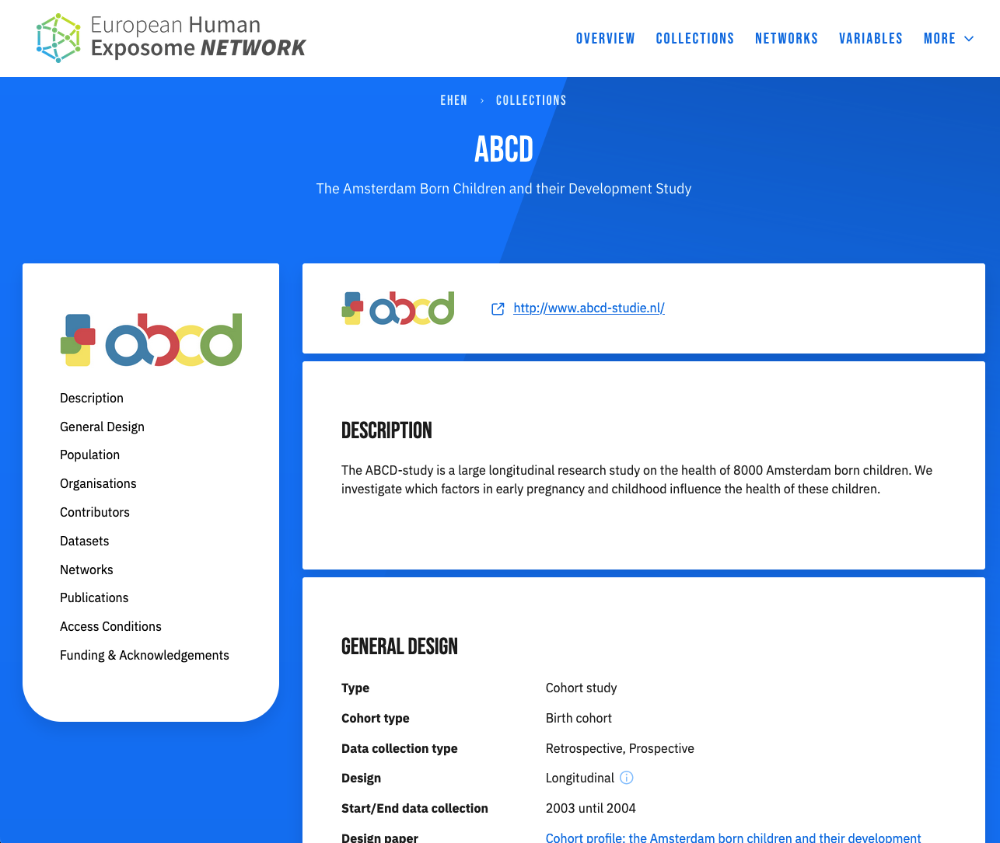
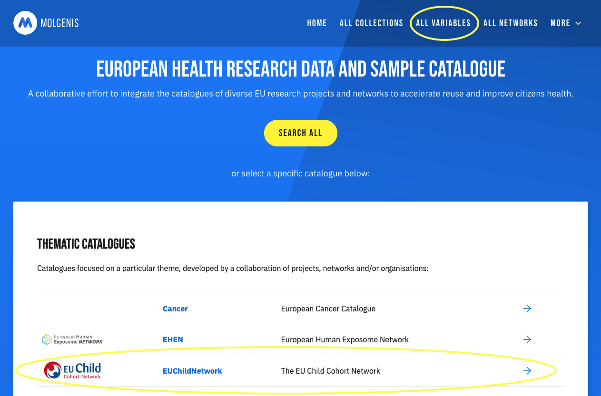
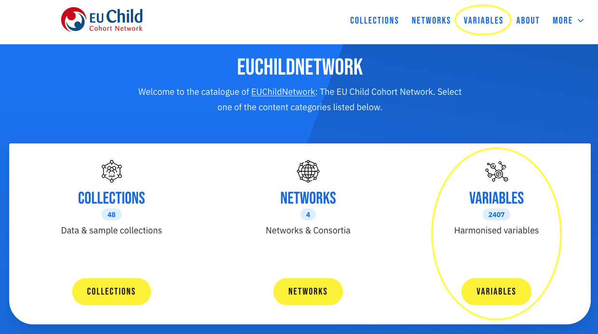
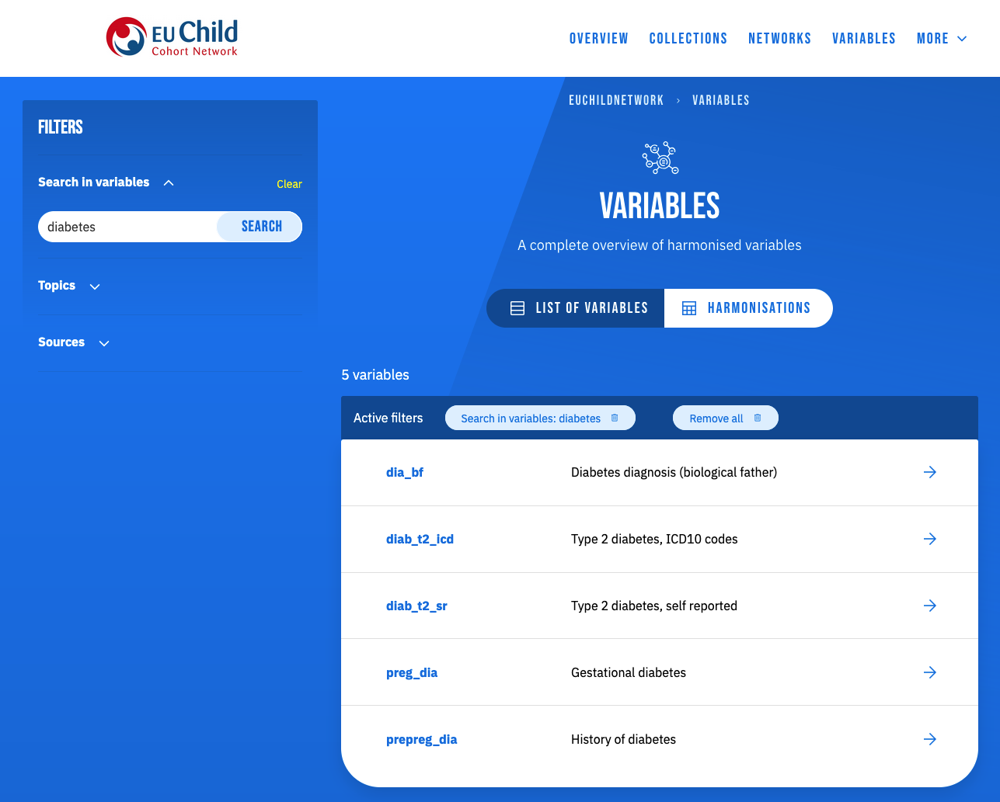
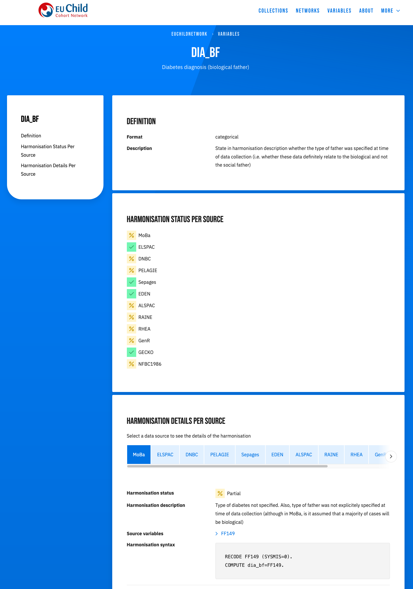

# Researcher

The [MOLGENIS Data Catalogue](https://data-catalogue.molgeniscloud.org/) is perfectly suited
to help you find the relevant data for your research question.
Using the catalogue, you can explore a variety of resources and compose a dataset
tailored to your research needs.

## Find rich metadata

Entering the catalogue, the landing page shows a list of available subcatalogues.
This list is divided between thematic catalogues, which cover a specific subject
and originate from collaborations between multiple projects,
and project catalogues, which originate from individual projects.

Selecting one of these, e.g. **EHEN**, will take you to a new landing page, where you can choose
to browse either collections, networks, or variables.
Alternatively, if you want to search across all data, regardless of project, you can use the **SEARCH ALL** button.

Selecting either **COLLECTIONS** or **NETWORKS** at the next step will provide you with a list of
collections or networks to browse through. To narrow down the list, you can do a text-based search (e.g. 'early pregnancy)
or filter on specific attributes (e.g. collections of type 'Biobank').

Clicking an item in the list will take you to a page containing detailed information on the resource in question.
Here, all information available in the catalogue about the resource is displayed.
You can either scroll through the page or navigate to a specific section of interest using the
index on the left-hand side. Also note that for some types of information, such as collection events or datasets,
clicking on a specific instance will provide more details about it (e.g. inclusion criteria for a certain subpopulation).

## Find harmonised variables

Harmonised variables (also called target variables) are variables
which are defined in the context of a common data model. For example, a network of organisations with access
to multiple data sources, like LifeCycle has defined a set of variables, called the common data model,
which all data sources can map their own variables to.
Here, mapping means the process of defining how to convert the collected variable from the data source (source variable)
to the harmonised variable in the common data model (target variable).
For example, a collected variable describing length at birth in inches can be mapped to a harmonised variable
describing length at birth in centimetres. These mappings can then be used as a basis for integrated analysis.

From the catalogue landing page, you can search all harmonised variables
by clicking **ALL VARIABLES** in the menu.

Alternatively, you can choose to only view the harmonised variables within a particular project,
such as the EUChildNetwork or LifeCycle. In that case, first go to the project you are interested in
and then click **VARIABLES**.

Please note that the catalogue only describes the harmonised variables,
it does *not* contain the actual data values.

You can use the search bar and filters to subset the harmonised variables.
In the example below, we searched for harmonised variables related to 'diabetes'.
Additionally, you can filter on topics to find relevant variables.
You can also make a selection of sources so that only variables
mapped to by these sources are shown.

*In the future you will be able to use a shopping cart to select all variables of interest and create an overview.*

## See harmonisation details

The harmonisation view (click **HARMONISATIONS**) allows you to see
which sources have (partially) harmonised your variables of interest and
thus have those variables available for analysis.

By clicking on a variable of interest (here `dia_bf`), a detailed harmonisation overview
of that particular variable is displayed, containing both the harmonisation status per source and
further details about the harmonisation like source variables and harmonisation syntax.

