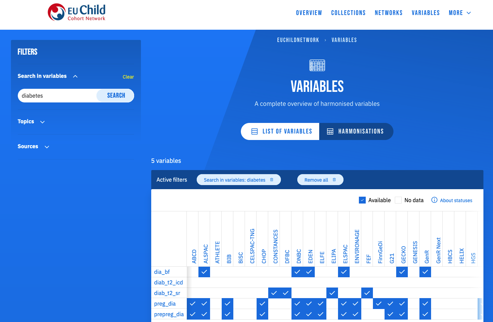

# Researcher

The [MOLGENIS Data Catalogue](https://data-catalogue.molgeniscloud.org/) is perfectly suited
to help you find the relevant data for your research question.
Using the catalogue, you can explore a variety of data sources and compose a dataset
tailored to your research needs.

Entering the catalogue, you can choose to either search all harmonised variables
(by clicking on `ALL VARIABLES` in the menu), or only the harmonised variables within a particular project,
such as the EUChildNetwork or LifeCycle. For the latter, first go to the project you are interested in
and then click `VARIABLES`.

Please note that the Data Catalogue only describes the harmonised variables,
it does **not** contain the actual data values.

## Find harmonised variables

You can use the search bar and filters to subset the harmonised variables.
In the example below, we searched for harmonised variables related to 'diabetes'.
Additionally, you can filter on topics to find relevant variables.
You can also make a selection of sources so that only variables
which have mappings to these sources are shown.

*In the future you will be able to use a shopping cart to select all variables of interest and create an overview.*

## See harmonisation details

The harmonisation view (click `HARMONISATIONS`) allows you to see
which sources have (partially) harmonised your variables of interest and
thus have those variables available for analysis.

By clicking on a variable of interest (here `dia_bf`), a detailed harmonisation overview
of that particular variable is displayed, containing both the harmonisation status per source and
further details about the harmonisation like source variables and harmonisation syntax.

<!-- Extend this screenshot to have harmonisation details as well -->