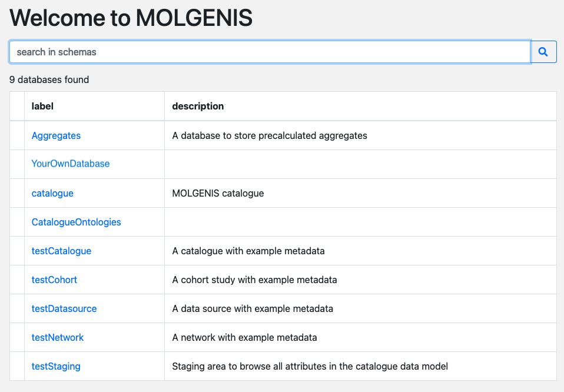

# Resource data manager

The [MOLGENIS Data Catalogue](https://data-catalogue.molgeniscloud.org/) provides a
framework for detailed descriptions of the following:
metadata of different types of data sources, such as cohort studies and biobanks;
definitions of the variables collected in these resources;
and mappings of these variables to common data models.
Its purpose is to provide a gateway for finding and accessing health research data
and to facilitate pooled data analysis of multiple cohorts ([Fortier et al, 2017](https://pubmed.ncbi.nlm.nih.gov/27272186/))
and multi-data source studies ([Gini et al, 2020](https://pubmed.ncbi.nlm.nih.gov/32243569/)).

The metadata of data sources consists of high-level descriptive information, such as contact details,
contents and design, and access and usage conditions.
In addition, the definitions of the source variables of a resource
(e.g. a cohort study like [ALSPAC](https://data-catalogue.molgeniscloud.org/catalogue/ssr-catalogue/all/collections/ALSPAC))
can be considered its codebook or data dictionary.
Similarly, the common data models (or 'target variables') can be considered the codebook for a network of organisations
with access to multiple data sources
(e.g. [LifeCycle](https://data-catalogue.molgeniscloud.org/catalogue/ssr-catalogue/LifeCycle/variables)).
Combining these two, the variable mappings describe how source variables have been converted into target variables,
which can be used as a basis for integrated analysis.

## Data harmonisation

Each organisation with access to data (which may be a cohort, or a data source composed of one or more data banks)
harmonises their data according to the consortium’s protocols into a common data model (CDM) format which has been
centrally agreed upon. In some projects, data may be made available via [DataSHIELD](https://www.datashield.org/).
In these cases each resource stores the data locally in a [MOLGENIS Armadillo](../armadillo/) DataSHIELD server.

## Staging areas for uploads

The metadata of the cohort or of the data source are first uploaded into what are called 'staging areas' of the MOLGENIS
catalogue. Later on the metadata are transferred to production; use of a staging area allows for review before the
metadata are entered in the live catalogue.

You will need credentials to log in and upload metadata. Contact us at [support@molgenis.org](mailto:support@molgenis.org)
to receive credentials.

When you log in, you will be able to see at least the following databases:

- **catalogue**: The catalogue data, in which metadata is visualized and you can search for target variables to map to.
- **CatalogueOntologies**: This database contains the look-up list that you need for filling out some columns in the
  templates, e.g. format or unit. If you need to add anything to these look-up lists, [contact us](mailto:support@molgenis.org).
- **Your own database**: Use this to fill out rich metadata and to upload the templates once you have filled them out.
- **Test databases** (here: testCohort, testDatasource and testNetwork): You can see filled out example metadata
  in these databases.
- **Aggregates**: a database where aggregate data are stored.

*Figure 1. Databases in the MOLGENIS catalogue staging area.*

## Fill out rich metadata

Open your staging area, navigate to 'Tables' and open the table 'Resources'. Your resource id and name are already
filled out. Click on the pencil sign next to this entry to start editing your rich metadata by filling out
the form. For cohort studies 'Subcohorts' and 'Collection events' should also be filled out through this route.
You can later refer to them from columns in the dictionary templates to indicate which variables were collected
during which collection event.

## Define codebooks or data dictionaries

This section explains how to submit 'source variables' + 'mappings from source variables to target variables' into
MOLGENIS catalogue. Expected users of this 'how to' are data managers within the organisations with access to cohorts or
data sources. This document assumes you have received login details for upload of your metadata. You can also watch
this [*instruction video*](https://www.youtube.com/watch?v=b_Ef_Uiw1gE&ab_channel=MOLGENIS). Note that this video used
dictionary model version 2.x, which was updated to 4.x. The basic principles remain the same,
but column names vary between these versions.

### Define source variable metadata / source data dictionary

We use the [*SourceDictionary template*](https://github.com/molgenis/molgenis-emx2/raw/master/docs/resources/SourceDictionary.xlsx)
to define variable metadata. The [*SourceDictionary
template*](https://github.com/molgenis/molgenis-emx2/raw/master/docs/resources/SourceDictionary.xlsx) consists of multiple
sheets. Each sheet corresponds to a table in the catalogue (Figure 1). The columns in the sheet correspond to
columns in the table concerned. This document describes how to fill out each of the sheets and their columns. A column
with an asterisk (\*) after its name is mandatory, i.e., it should contain values for the system to accept a data
upload. You can download this
[*filled out example*](https://github.com/molgenis/molgenis-emx2/raw/master/docs/resources/SourceDictionary_testCohort.xlsx)
as a reference for filling out the template.

It is good practice to try adding a few variables to the template first and see whether your upload succeeds. To
upload the metadata to the catalogue see the section [Upload metadata](cat_resource-data-manager.md#upload-metadata).

*Figure 2. Tables in a cohort's database in the MOLGENIS catalogue. Note that not all tables are filled out
via the templates, some are filled via an online form, see section
[Fill out rich metadata](cat_resource-data-manager.md#fill-out-rich-metadata).*

### *Datasets* sheet

The datasets/tables for a resource, such as a cohort or databank of a data source are defined in the *Datasets* sheet.
Columns with an asterisk (\*) after their name are mandatory.

| *Column name* | *Description* | *Remarks* |
| --- | --- | --- |
| resource \* | Resource that this dataset or table belongs to. Fill out your resource id | The resource id is found in the table *Resources* in the resource staging area |
| name \* | Unique dataset or table name | |
| label | Dataset label | |
| dataset type1  | Type of dataset | Find list to choose from in CatalogueOntologies [Dataset types](https://data-catalogue.molgeniscloud.org/CatalogueOntologies/tables/#/DatasetTypes) |
| description | Dataset description | |
| unit of observation1  | Defines what each record in this dataset describes | Find list to choose from in CatalogueOntologies [Observation targets](https://data-catalogue.molgeniscloud.org/CatalogueOntologies/tables/#/ObservationTargets) |
| number of rows | Count of the number of records in this dataset | |
| keywords1 | Enables grouping of datasets into topics and helps to display variables in a tree | Find list to choose from in CatalogueOntologies [Keywords](https://data-catalogue.molgeniscloud.org/CatalogueOntologies/tables/#/Keywords) |
| since version | Version of the data model when this dataset was introduced | e.g. 1.0.0 or 2.1 |
| until version | Version of the data model when this dataset was deleted | e.g. 2.0.0 or 2.1 |

_Table 1. Description of the columns that can be filled out for Datasets.
\* = mandatory; 1 = contact [*molgenis support*](mailto:support@molgenis.org)
to add Keywords, Observation targets or Dataset types_

### *Variables* sheet

The variables of the datasets specified in the *Datasets* sheet are defined in the *Variables* sheet.

| *Column name* | *Description* | *Remarks* |
| --- | --- | --- |
| resource \* | Resource that this variable belongs to. Fill out your resource id | The resource id is found in the table *Resources* in the resource staging area |
| dataset \* | Dataset that contains the variable. | Datasets must be predefined in the *Datasets* sheet |
| name \* | Variable name, unique within a dataset | |
| label | Human readable variable label | |
| format | The data type of the variable | Find list to choose from in CatalogueOntologies [Formats](https://data-catalogue.molgeniscloud.org/CatalogueOntologies/tables/#/Formats) |
| unit1 | Unit in case of a continuous or integer format | Find list to choose from in CatalogueOntologies [Units](https://data-catalogue.molgeniscloud.org/CatalogueOntologies/tables/#/Units) |
| description | Description of the variable | |
| example values | Examples of values in a comma separated list | Makes your data structure more insightful. E.g. 1,2,3 or TRUE,FALSE or 1.23,4.56,3.14 |
| repeat unit1  | In case of repeated variables, indicate the repeat period | Find list to choose from in CatalogueOntologies [Repeat units](https://data-catalogue.molgeniscloud.org/CatalogueOntologies/tables/#/RepeatUnits) |
| repeat min | The minimum repeat unit | E.g. 0 or 10 |
| repeat max | The maximum repeat unit | E.g. 10 or 60 |
| collection events | Refer to the names of collection events in a comma separated list | The collection events need to be predefined in the Collection events table in the resource staging area; e.g. y1, y2 |
| vocabularies1 | Refer to ontologies being used | Find list to choose from in CatalogueOntologies [Vocabularies](https://data-catalogue.molgeniscloud.org/CatalogueOntologies/tables/#/Vocabularies) |
| keywords1 | Enables grouping of variables into topics and helps to display variables in a tree | Find list to choose from in Catalogue [Keywords](https://data-catalogue.molgeniscloud.org/CatalogueOntologies/tables/#/Keywords)|
| since version | Version of the data model when this variable was introduced | e.g. 1.0.0 or 2.1 |
| until version | Version of the data model when this variable was deleted | e.g. 2.0.0 or 2.1 |
| useExternaldefinition.resource | Refer to the associated resource id | When using the definitions of a harmonised variable from another CDM |
| useExternaldefinition.dataset | Refer to the associated dataset name | When using the definitions of a harmonised variable from another CDM |
| useExternaldefinition.name | Refer to the associated variable name | When using the definitions of a harmonised variable from another CDM |

_Table 2. Description of the columns that can be filled out for Variables. \* = mandatory;
1 = contact [*molgenis support*](mailto:support@molgenis.org) to add Vocabularies, Keywords, Repeat units, or Units_

### *Variable values* sheet

The coding of categorical variables is defined in the *Variable values* sheet. This sheet is optional, but it is
highly recommended to fill out the codes and values for your categorical variables, so that your data becomes more
insightful for those that are interested.

| *Column name* | *Description* | *Remarks* |
| --- | --- | --- |
| resource \* | Resource that the variable belongs to. Fill out your resource id | The resource id is found in the table *Resources* in the resource staging area |
| dataset \* | Dataset that contains the variable | Datasets must be predefined in the *Datasets* sheet |
| name \* | Variable name | Variables must be predefined in the *Variables* sheet |
| value \* | The code or value used | e.g. 1, 2 or -99 |
| label \* | The label corresponding to the value | e.g. 'yes', 'no' or 'NA' |
| order | The order in which the code list should appear | e.g. 1 |
| is missing | Whether this value indicates a missing field | TRUE or FALSE |
| since version | Version of the data model when this variable value was introduced | e.g. 1.0.0 or 2.1 |
| until version | Version of the data model when this variable value was deleted | e.g. 2.0.0 or 2.1 |

_Table 3. Description of the columns that can be filled out for Variable values. \* = mandatory_

### Define harmonisations

We use the [*Mappings* template*](https://github.com/molgenis/molgenis-emx2/raw/master/docs/resources/Mappings.xlsx) to
describe the harmonisations. The
[*Mappings* template*](https://github.com/molgenis/molgenis-emx2/raw/master/docs/resources/Mappings.xlsx) consists of two
sheets (Dataset mappings and Variable mappings). It is used to define the mappings from source variables to target
variables, or the Extraction, Transformation and Load (ETL) process from a data source to a common data model (CDM).
You can download this
[*filled out example*](https://github.com/molgenis/molgenis-emx2/raw/master/docs/resources/Mappings_testCohort.xlsx)
as a reference for filling out the template.

### *Dataset mappings* sheet

Harmonisation procedures at the table level are defined in the *Dataset mappings* sheet, irrespective of whether the table
is in a cohort or in a data bank.

| *Column name* | *Description* | *Remarks* |
| --- | --- | --- |
| source \* | Resource id. Fill out your resource id | The resource id is found in the table *Resources* in the resource staging area |
| source dataset \* | Source dataset name | Datasets must be predefined in the *Datasets* sheet in the SourceDictionary template |
| target \* | Name of the target CDM  | e.g. LifeCycle or LongITools |
| target dataset \* | Target dataset name | Map to a dataset that is defined in a CDM |
| description | Description of the harmonisation | |
| syntax | Syntax used for this harmonisation | |

_Table 4. Description of the columns that can be filled out for Variable mappings. \* = mandatory_

### *Variable mappings* sheet

Harmonisation procedures at the variable level are defined in the *Variable mappings* sheet.

| *Column name* | *Description* | *Remarks* |
| --- | --- | --- |
| source \* | Resource id. Fill out your resource id | The resource id is found in the table *Resources* in the resource staging area |
| source dataset \* | Source table name | Datasets must be predefined in the *Datasets* sheet in the SourceDictionary template |
| source variables | Source variable name(s) | Variables must be predefined in the *Variables* sheet in the SourceDictionary template; When multiple variables are mapped together use a comma-separated list, e.g. v1,v2,v3 |
| source variables other datasets.dataset | Other source tables | When using variables from multiple other datasets, use a comma-separated list, e.g. dataset1,dataset2,dataset31 |
| source variables other datasets.name | Source variable(s) from other datasets than filled out under source dataset | When using variables from multiple other datasets, use a comma-separated list, the order corresponding to the order of the datasets they are derived from specified under source variables from other datasets.dataset1 |
| target \* | Name of the target CDM  | e.g. LifeCycle or LongITools |
| target dataset \* | Target dataset name. | Map to a dataset that is defined in a CDM |
| target variable \* | Target variable name | Map to a variable that is defined in a CDM |
| match \* | Whether the harmonisation is partial, complete or na (non-existent) | Find list to choose from in CatalogueOntologies [StatusDetails](https://data-catalogue.molgeniscloud.org/CatalogueOntologies/tables/#/StatusDetails) |
| repeats | In the case of a repeated target variable, comma separated list of repeats that were mapped to | e.g. 0,1,2,6,12 |
| description | Description of the harmonisation | |
| syntax | Syntax used for this harmonisation | |

_Table 5. Description of the columns that can be filled out for Variable mappings. \* = mandatory;
1 = see sheet Variable mappings in the
[example template](https://github.com/molgenis/molgenis-emx2/raw/master/docs/resources/Mappings_testCohort.xlsx)
for an example on how to fill this out (last line)_

## Upload metadata

When you have filled out the template(s) you can start uploading metadata. When you log in to
[*MOLGENIS catalogue*](https://data-catalogue.molgeniscloud.org/apps/central/#/)
you will see a listing of databases that are accessible to you. Click on your resource's database to access it.
Go to 'Up/Download' in the menu. Use 'browse' to select a template and 'upload' to start uploading your metadata. After
uploading, you can view your metadata under 'Tables'.

Please report any bugs or difficulties to [*molgenis support*](mailto:support@molgenis.org).

### Find harmonisations

When your data is uploaded to the Data Catalogue you can find your own harmonised variables in variable details in the
[Harmonised variable explorer](https://data-catalogue.molgeniscloud.org/apps/docs/#/catalogue/cat_researcher)
once they have been transferred there.

### Request access (catalogue)

If you do not have an account to upload data to the catalogue yet, please
email [*molgenis support*](mailto:support@molgenis.org) to apply for an account.
