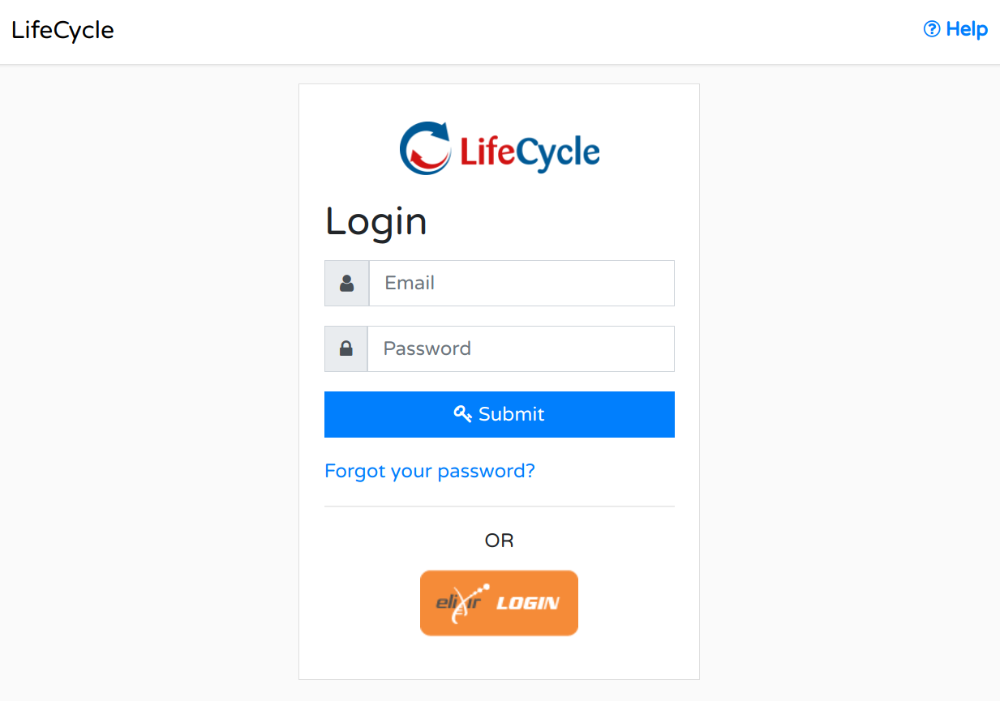
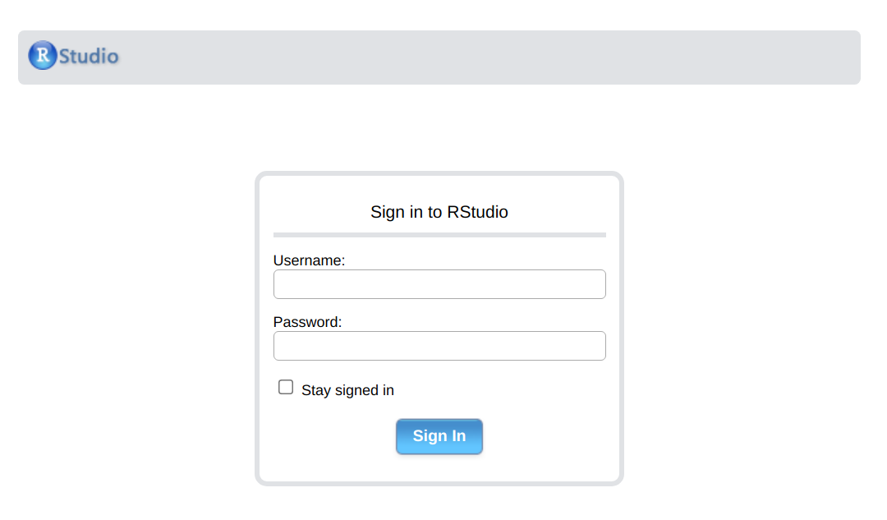

# Researcher

## Armadillo

[MOLGENIS Armadillo](https://github.com/molgenis/molgenis-r-armadillo) allows you to analyse data uploaded in the Armadillo in a federated way. This means that you send the analysis to the Armadillo and results come back from the Armadillo to the researcher.

Harmonised data is uploaded by a cohort data manager into a local Armadillo/Opal instance to make it available for the researcher to run analysis.

### Request federated access

We encourage users to move towards central authentication used by different consortia. Which means that we try to use the accounts of as many of the institutions as possible for logins to all the cohort federated platforms. [ELIXIR](https://elixir-europe.org/) is a European platform which has contracts with most of the research institutes; it allows you to login with your own account. This is used for all Armadillo instances, the MOLGENIS catalogue, and for the central analysis server as well. Visit: [https://elixir-europe.org/](https://elixir-europe.org/) for more information.

In order to access and analyse data, you need to log into a central login server. You can follow [this video](https://youtu.be/Gj0uANX8nIw) to create an account on the authentication server.

### Request permissions

You need to request permissions to the data by sending an email to the relevant cohort data manager(s). You will need to specify which variables you want to use. Be specific about this. The cohort data manager can then grant you permissions to the data that you requested.

After the correct authentication and authorisation steps have been set up you will be able to analyse the cohort’s data via DataSHIELD.

### Use DataSHIELD

DataSHIELD is an infrastructure and series of R packages that enables the remote and non-disclosive analyses of sensitive research data. Users are not required to have prior knowledge of R ([datashield.org](https://www.datashield.org/)).

After successful authentication you need [DSMolgenisArmadillo](https://molgenis.github.io/molgenis-r-datashield/) installed locally on your machine in order to analyse data shared on [MOLGENIS Armadillo](https://github.com/molgenis/molgenis-service-armadillo) servers using DataSHIELD.

    install.packages("DSI")
    install.packages("DSMolgenisArmadillo")

## Analysis environment

Some networks use the analysis environment instead of or alongside the locally installed MOLGENIS Armadillo. The analysis environment is centralised. You will be using a web based RStudio which is available here: [https://analysis.gcc.rug.nl](https://analysis.gcc.rug.nl).

### Request analysis access

Access to the analysis environment is centralised, which means that you have to request access. To request access send an email to [molgenis-support@umcg.nl](mailto:molgenis-support@umcg.nl). Please specify for which cohort you work and the PI responsible.

### Use the analysis environment

You need at least 3 packages to work with DataSHIELD on the central analysis server:

- [dsBaseClient](https://github.com/datashield/dsBaseClient) → is the DataSHIELD analysis packages
- [DSOpal](https://github.com/datashield/DSOpal) → allowes you to connect to the Opals
- [DSMolgenisArmadillo](https://molgenis.github.io/molgenis-r-datashield) → allows you to connect to the Armadillos

These packages are pre-installed. You will not have to install them again. In the future we will support profiles which you can choose when you login.
