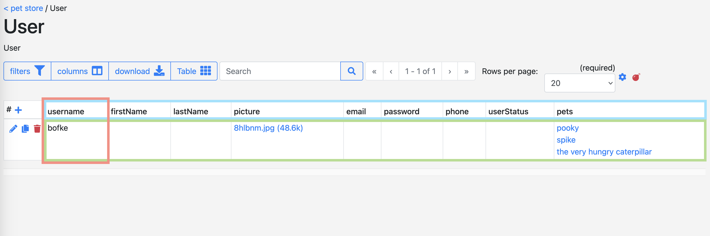

# Using semantic feature

You can create useful RDF output by annotating our model.
For this you use the `semantics` field in EMX2.

## Formatting

There are 2 types of data allowed in this field:
* an IRI (such as `http://purl.org/dc/terms/title`)
* a prefixed name (such as `dcterms:title`), assuming that prefix [is defined](#defined-namespaces)
 

When processing a semantic field, a check is done to see if it can be interpreted as a prefixed name (based on the defined namespaces for that scheme).
If not, then it is assumed to be an IRI.

Multiple values can be defined by separating these by a comma (such as `dcterms:title,http://purl.org/dc/terms/description`).

## Defined namespaces

By default, the following prefixed names are available:
<!-- see: https://github.com/molgenis/molgenis-emx2/blob/master/backend/molgenis-emx2-rdf/src/main/java/org/molgenis/emx2/rdf/DefaultNamespace.java -->
<!-- regex-from: ^.*\("([\w\-]+)", "([\d\w:\/\.\-\#]+)".*$ -->
<!-- regex-to: | $1 | $2 | -->

| prefix        | IRI                                            |
|---------------|------------------------------------------------|
| afr           | http://purl.allotrope.org/ontologies/result#   |
| afrl          | http://purl.allotrope.org/ontologies/role#     |
| dc            | http://purl.org/dc/elements/1.1/               |
| dcat          | http://www.w3.org/ns/dcat#                     |
| dcterms       | http://purl.org/dc/terms/                      |
| edam          | http://edamontology.org/                       |
| efo           | http://www.ebi.ac.uk/efo/                      |
| ejp           | https://w3id.org/ejp-rd/vocabulary#            |
| ensembl       | http://ensembl.org/glossary/                   |
| fdp-o         | https://w3id.org/fdp/fdp-o#                    |
| fg            | https://w3id.org/fair-genomes/resource/        |
| foaf          | http://xmlns.com/foaf/0.1/                     |
| healthDCAT-AP | urn:uuid:a7ef52b2-bd43-4294-a80f-3e7299af35e4# |
| hl7           | http://purl.bioontology.org/ontology/HL7/      |
| ldp           | http://www.w3.org/ns/ldp#                      |
| lnc           | http://purl.bioontology.org/ontology/LNC/      |
| mesh          | http://purl.bioontology.org/ontology/MESH/     |
| obo           | http://purl.obolibrary.org/obo/                |
| oboInOwl      | http://www.geneontology.org/formats/oboInOwl#  |
| odrl          | http://www.w3.org/ns/odrl/2/                   |
| ordo          | http://www.orpha.net/ORDO/                     |
| org           | http://www.w3.org/ns/org#                      |
| owl           | http://www.w3.org/2002/07/owl#                 |
| prov          | http://www.w3.org/ns/prov#                     |
| qb            | http://purl.org/linked-data/cube#              |
| rdf           | http://www.w3.org/1999/02/22-rdf-syntax-ns#    |
| rdfs          | http://www.w3.org/2000/01/rdf-schema#          |
| schema        | http://schema.org/                             |
| sio           | http://semanticscience.org/resource/           |
| skos          | http://www.w3.org/2004/02/skos/core#           |
| snomedct      | http://purl.bioontology.org/ontology/SNOMEDCT/ |
| vcard         | http://www.w3.org/2006/vcard/ns#               |
| xsd           | http://www.w3.org/2001/XMLSchema#              |

!> The IRI for healthDCAT-AP is a placeholder as it [currently does not have one defined](https://healthdcat-ap.github.io/#namespaces).

!> The list above can be overridden using a [schema-specific advanced setting](./dev_rdf.md#custom-semantic-prefixes).

## Ontologies

If semantics are defined for a column that refers to an ontology table, a check is made to see if an `ontologyTermURI` is defined for that target reference.
If this is the case, a triple is generated that uses the `ontologyTermURI` directly as object instead of an IRI that refers to the primary key of the ontology table.
This way, ontologies can be used to define a list of allowed IRIs for a specific column in a data table.

## Examples

### Semantics in general 

Using the pet store schema with demo data, the User table looks like this:

In this example, `username` is the primary key of the table.
Therefore, it defines the subject of a triple.
If there is a composite key, the combination of these columns define the subject.

The semantics value for each column define the predicates.
No matter if the semantics field is empty or not, EMX2 always generates it's own EMX2 format.

Finally, the actual values in a cell define the objects in a triple.
If the `ColumnType` is an `ARRAY`, multiple objects can be present.

To visualize this using the actual RDF Turtle output generated by this table, specific fields have been colored below similar to the image/text above:

<pre style="white-space: pre-wrap;">
&lt;http://localhost:8080/pet%20store/api/rdf/User?username=bofke&gt; a PetStore:User, qb:Observation,
foaf:Person;
qb:dataSet PetStore:User;
rdfs:label "bofke";
foaf:accountName "bofke";
&lt;http://localhost:8080/pet%20store/api/rdf/User/column/username&gt; "bofke";
foaf:img &lt;http://localhost:8080/pet%20store/api/file/User/picture/8b6677b7700c44118c953eb79c76d76a&gt;;
&lt;http://localhost:8080/pet%20store/api/rdf/User/column/picture&gt; &lt;http://localhost:8080/pet%20store/api/file/User/picture/8b6677b7700c44118c953eb79c76d76a&gt;;
&lt;http://example.com/petstore#hasPets&gt; &lt;http://localhost:8080/pet%20store/api/rdf/Pet?name=the+very+hungry+caterpillar&gt;,
&lt;http://localhost:8080/pet%20store/api/rdf/Pet?name=spike&gt;, &lt;http://localhost:8080/pet%20store/api/rdf/Pet?name=fire+ant&gt;,
&lt;http://localhost:8080/pet%20store/api/rdf/Pet?name=pooky&gt;;
&lt;http://localhost:8080/pet%20store/api/rdf/User/column/pets&gt; &lt;http://localhost:8080/pet%20store/api/rdf/Pet?name=the+very+hungry+caterpillar&gt;,
&lt;http://localhost:8080/pet%20store/api/rdf/Pet?name=spike&gt;, &lt;http://localhost:8080/pet%20store/api/rdf/Pet?name=fire+ant&gt;,
&lt;http://localhost:8080/pet%20store/api/rdf/Pet?name=pooky&gt;;
fdp-o:metadataIssued "2025-02-20T13:46:29"^^xsd:dateTime;
dcterms:issued "2025-02-20T13:46:29"^^xsd:dateTime;
&lt;http://localhost:8080/pet%20store/api/rdf/User/column/mg_insertedOn&gt; "2025-02-20T13:46:29"^^xsd:dateTime;
fdp-o:metadataModified "2025-02-20T13:46:29"^^xsd:dateTime;
&lt;http://localhost:8080/pet%20store/api/rdf/User/column/mg_updatedOn&gt; "2025-02-20T13:46:29"^^xsd:dateTime .
</pre>

### References to an ontology table

When a reference is done to an ontology table, it slightly deviates from a regular reference.
For the example below, keep in mind that the referenced ontology table contains the following rows regarding color:

| name   | parent | ontologyTermURI                |
|--------|--------|--------------------------------|
| colors |        |                                |
| red    | colors | https://dbpedia.org/page/Red   |
| green  | colors | https://dbpedia.org/page/Green |
| blue   | colors |                                |
| purple | colors |                                |

The objects of the non-semantic predicate are IRIs that refer to the primary key of the ontology table (like a regular reference).  

However, the objects of the semantic predicate contain the `ontologyTermURI` belonging to that ontology reference, if one was found (as can be seen for "red" and "green"). If no `ontologyTermURI` was defined, it uses the primary key of the ontology table instead (see "purple").

<pre style="white-space: pre-wrap;">
&lt;http://localhost:8080/pet%20store/api/rdf/Pet?name=fire+ant&gt; a PetStore:Pet, qb:Observation;
dcat:endpointURL &lt;http://localhost:8080/pet%20store/api/rdf/&gt;;
fdp-o:metadataIdentifier &lt;http://localhost:8080/pet%20store/api/rdf/Pet?name=fire+ant&gt;;
qb:dataSet PetStore:Pet;
rdfs:label "fire ant";
&lt;http://localhost:8080/pet%20store/api/rdf/Pet/column/name&gt; "fire ant";
&lt;http://localhost:8080/pet%20store/api/rdf/Pet/column/category&gt; &lt;http://localhost:8080/pet%20store/api/rdf/Category?name=ant&gt;;
&lt;http://localhost:8080/pet%20store/api/rdf/Pet/column/status&gt; "available";
&lt;http://localhost:8080/pet%20store/api/rdf/Pet/column/tags&gt; &lt;http://localhost:8080/pet%20store/api/rdf/Tag?name=purple&gt;,
&lt;http://localhost:8080/pet%20store/api/rdf/Tag?name=green&gt;, &lt;http://localhost:8080/pet%20store/api/rdf/Tag?name=red&gt;;
&lt;http://example.com/petstore#hasTags&gt; &lt;http://localhost:8080/pet%20store/api/rdf/Tag?name=purple&gt;,
&lt;https://dbpedia.org/page/Red&gt;, &lt;https://dbpedia.org/page/Green&gt;;
&lt;http://localhost:8080/pet%20store/api/rdf/Pet/column/weight&gt; 1.0E-2;
&lt;http://localhost:8080/pet%20store/api/rdf/Pet/column/mg_insertedOn&gt; "2025-03-18T12:04:55"^^xsd:dateTime;
&lt;http://localhost:8080/pet%20store/api/rdf/Pet/column/mg_updatedOn&gt; "2025-03-18T12:04:55"^^xsd:dateTime .
</pre>