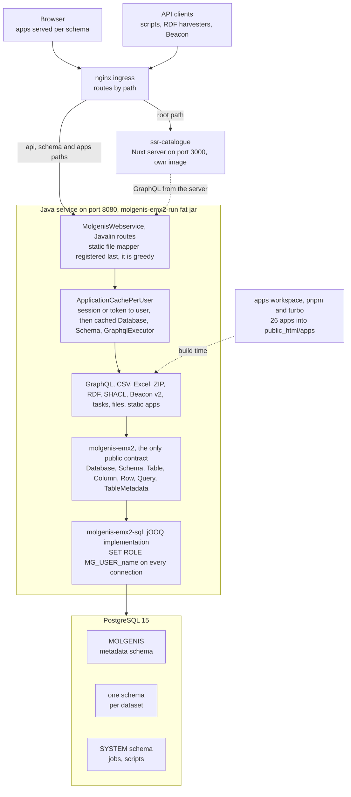
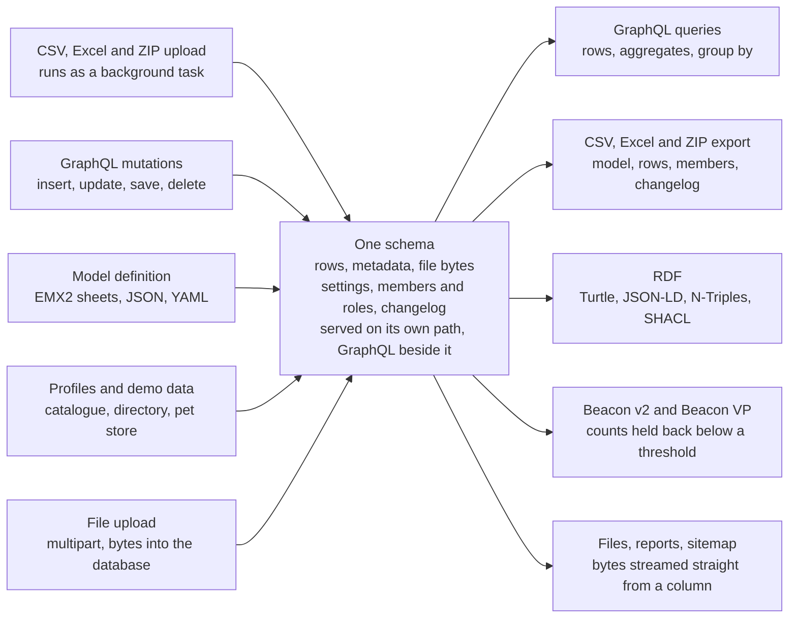

# System overview

This page describes how EMX2 fits together as a whole: the components, how a request travels
through them, how data gets in and out, and what the database actually holds. For the design
decisions behind individual features, see [Architecture](./dev_architecture.md).

## The one idea

A MOLGENIS schema is a PostgreSQL schema. From that single decision the rest of the system
follows. Each schema is served on its own URL path, gets its own GraphQL endpoint, gets a copy of
every app, and carries its own set of roles.

The second decision matters as much: **authorization is not implemented in Java**. Every EMX2 user
is a real PostgreSQL role named `MG_USER_<name>`, and `SqlUserAwareConnectionProvider` issues
`SET ROLE` before handing a connection to jOOQ. Grants and row level security policies do the
enforcing, so a query that should return nothing returns nothing even if the Java layer above it
is wrong.

What the Java layer does instead is *shape the surface*. The GraphQL type system is generated per
caller: a viewer sees table fields a counter does not, and an aggregator sees ranges where a viewer
sees exact counts.

The third decision is what makes app development cheap. Apps ask for GraphQL at the **relative**
path `graphql`. A page served at `/pet store/tables/` resolves that to `/pet store/graphql` without
knowing which schema it is in. The per-schema context is the URL prefix and nothing else.

## Components

Two front ends, one Java service, one database. The catalogue is server rendered, so it runs as its
own process and fetches from the Java service like any other client. Everything else is static and
ships inside the jar.

The dashed line from `apps/` is build time, not run time: the frontend workspace is compiled once
and copied into the jar as classpath resources by the `collectDist` task in `apps/build.gradle`. The
catalogue is the exception, since a server-rendered app has no static output to copy.

## What happens to one request

The interesting hop on the way down is step 3. A user key is resolved once, then the whole per-user
object graph comes out of a cache, including a GraphQL schema built for that user's permissions. On
the way back up, the notable thing is how little happens: the JSON was assembled by the database and
travels to the client almost untouched.

```mermaid
flowchart TB
  s1["1. Javalin matches a route<br>MolgenisWebservice registers every Api class in order"]
  s2["2. Who is asking<br>session attribute, else the x-molgenis-token header, else anonymous"]
  s3["3. ApplicationCachePerUser hands back the user objects<br>cached five minutes, a schema change clears everything"]
  s4["4. Resolve the schema from the path<br>null when the caller PostgreSQL role cannot see it"]
  s5["5. GraphqlExecutor runs the query<br>the type system was shaped by PermissionEvaluator"]
  s6["6. SqlQuery builds one statement for the whole selection tree<br>nested jsonb_agg, assembled by the database"]
  s7["7. The connection becomes the user<br>RESET ROLE, then SET ROLE MG_USER_name"]
  s8["8. PostgreSQL decides what is visible<br>table grants and row level security policies"]
  s9["9. One JSON string comes back<br>no row by row mapping into Java objects"]
  s10["10. The connection stops being the user<br>RESET ROLE and RESET search_path, then back into the pool"]
  s11["11. GraphQL wraps data and errors into one body<br>sent as JSON with status 200, even when the body carries errors"]
  s12["12. Anything thrown leaves through one handler<br>every exception becomes a 400 JSON body"]

  s1 --> s2 --> s3 --> s4 --> s5 --> s6 --> s7 --> s8
  s8 -->|"the request turns around here"| s9
  s9 --> s10 --> s11 --> s12
```

Three steps catch people out:

- **Step 3.** A permission change may take up to five minutes to show, unless a schema change
  clears the cache.
- **Step 7.** The SQL layer cannot be bypassed by calling a Java method directly.
- **Step 11.** A GraphQL request that failed still answers `200`, with the failure inside the body.

A write commits before step 9. If the commit changed the model, a listener empties the cache from
step 3. Writes otherwise take the same path, funnelled through one batching transaction in
`SqlTable`.

## Ways in, ways out

Data arrives as rows or as a model, and the same endpoint handles both. Posting a CSV whose filename
matches an existing table is treated as row data. Posting anything else is parsed as an EMX2 model
and migrates the schema. That is why a single ZIP can define a database and fill it in one
transaction.

Import and profile loading run as background tasks: the endpoint returns a task reference and the
client polls `/api/tasks/{id}`. Everything else is synchronous.

## What the database holds

Three kinds of PostgreSQL schema live side by side. Table inheritance is real inheritance with a
discriminator column, which is why row mutations are batched per subclass.

| Schema | Holds |
|:--|:--|
| one per dataset | the tables of the model, plus `mg_changelog` when enabled |
| `MOLGENIS` | schema, table and column metadata, users, the database version |
| `_SYSTEM_` | jobs, scripts and their cron expressions, Beacon response templates |

Inside a dataset schema:

- every row carries `mg_tableclass`, `mg_insertedBy`/`mg_insertedOn`, `mg_updatedBy`/`mg_updatedOn`
- a `FILE` column expands into six sibling columns, the bytes included
- a trigger keeps the `mg_search` tsvector current
- inheritance is parent and child tables joined on the discriminator
- refs are real foreign keys, refbacks are maintained by trigger

Migrations run as one transaction. A step that cannot migrate throws, and nothing is applied. See
[Migrations](./dev_migrations.md).

### The role ladder

Roles are named `MG_ROLE_<schema>/<Role>` and each is granted into the next, so the ladder is a real
PostgreSQL role hierarchy.

| Role | Can |
|:--|:--|
| Member | belong to the schema |
| Exists | get yes or no answers only |
| Range | see bucketed minimum and maximum |
| Aggregator | see counts above a threshold |
| Count | see exact counts |
| Viewer | read rows |
| Editor | write rows |
| Manager | change the model and settings |
| Owner | grant and revoke |

The lower five rungs are the anonymised access tiers used by registries and by Beacon. They exist so
a caller can be told a cohort is large enough to be worth asking about, without being told who is in
it. Row level security adds a narrower layer: a policy can match a role stored on the row itself,
and it is switched off again automatically once no such grants remain. See
[Permissions](./use_permissions.md).

## Backend modules

Dependencies flow toward the core. Nothing below the web layer knows about HTTP, and nothing except
the SQL module writes SQL.

| Module | What it is for |
|:--|:--|
| `molgenis-emx2` | The public contract. Interfaces, metadata types, and the permission model. No database code at all. |
| `molgenis-emx2-sql` | The jOOQ and PostgreSQL implementation. Query building, batched mutations, roles, row level security, migrations. |
| `molgenis-emx2-io` | Import and export. One table store abstraction serves CSV, Excel, ZIP and classpath directories alike. |
| `molgenis-emx2-graphql` | Builds the per-database and per-schema GraphQL schemas, and holds the JSON form of schema metadata. |
| `molgenis-emx2-tasks` | The task tree, the in-database task service, and a Quartz scheduler kept in sync with the scripts table. |
| `molgenis-emx2-webapi` | The Javalin layer. Every endpoint, the per-user cache, sessions and OpenID Connect, static app serving, metrics. |
| `molgenis-emx2-run` | The runnable aggregator. Adds the built apps and the docs to the classpath and nothing else. |
| `molgenis-emx2-datamodels` | Profiles and loaders. Turns a YAML profile into a working schema, including the demo databases. |
| `molgenis-emx2-rdf` | RDF generation in several serialisations, SHACL validation sets, and SPARQL query generation. |
| `molgenis-emx2-beacon-v2` | The GA4GH Beacon v2 and Beacon VP surface, its filters, and its response templates. |
| `molgenis-emx2-cafevariome` | CafeVariome record and record index queries, built on the Beacon module. |
| `molgenis-emx2-fairmapper` | A standalone command line tool that harvests remote RDF and FAIR Data Point endpoints into EMX2. |
| `molgenis-emx2-analytics` | Per-schema analytics triggers and their storage. |
| `molgenis-emx2-email` | Sending mail, used by the message endpoint and by failing scheduled tasks. |
| `molgenis-emx2-typescript` | Generates TypeScript types from a live schema, so apps never hand-write table interfaces. |
| `molgenis-emx2-fairdatapoint` | All but empty. The FAIR Data Point surface is now a profile plus SHACL over the RDF endpoints. |
| `molgenis-emx2-nonparallel-tests` | Tests that cannot share the database with anything else. Runs last by design. |

## Frontend packages

The apps split by era. The older ones are Vue single page apps on a Bootstrap component library with
an axios client. The newer ones are Nuxt, extending a shared Tailwind layer and fetching through
server routes. See [Building frontend apps](./dev_apps.md).

| Package | Kind | Role |
|:--|:--|:--|
| `metadata-utils` | library | Shared types and GraphQL field builders. Consumed by almost everything. |
| `molgenis-components` | library | The Bootstrap era component library and the axios GraphQL client, including the relative path convention. |
| `tailwind-components` | Nuxt layer | The current design system, its composables, its themes, and the server proxy routes. |
| `molgenis-viz` | library | Charts and dashboard pieces built on D3, used by the registry sites. |
| `central`, `tables`, `schema`, `settings` | Vue SPA | The core platform: landing page, table browser, model designer, settings and theme editor. |
| `updownload`, `tasks`, `reports` | Vue SPA | Import and export, the job monitor, and the SQL report viewer. |
| `ui` | Nuxt SPA | The next generation replacement for the core platform apps. |
| `catalogue` | Nuxt SSR | The data catalogue. Server rendered, its own image, pinned to one schema by configuration. |
| `directory`, `aggregates` | Vue SPA | The biobank directory and the aggregate explorer. |
| `ern-*`, `cranio-*`, `nestor-public` | Vue SPA | Registry sites and dashboards for individual research networks. |
| `helloworld` | Vue SPA | The template. Copy it to start a new app. |

## Where to look first

Ten files carry most of the architecture. Reading them in this order gets you from the entry point
to the database without detours.

1. `backend/molgenis-emx2-webapi/.../RunMolgenisEmx2.java` — the main method: port, database, demo
   data, then start the web service.
2. `backend/molgenis-emx2-webapi/.../web/MolgenisWebservice.java` — every route in the system, in
   registration order.
3. `backend/molgenis-emx2-webapi/.../web/ApplicationCachePerUser.java` — identity, caching and
   invalidation. The busiest hinge in the codebase.
4. `backend/molgenis-emx2-graphql/.../GraphqlFactory.java` — where a caller's permissions become a
   GraphQL type system.
5. `backend/molgenis-emx2/.../PermissionEvaluator.java` — the permission rules, with no SQL anywhere
   near them.
6. `backend/molgenis-emx2-sql/.../SqlQuery.java` — the read engine. One nested JSON query per
   GraphQL selection tree.
7. `backend/molgenis-emx2-sql/.../SqlTable.java` — the write path. Every mutation batches through
   one transaction.
8. `backend/molgenis-emx2-sql/.../SqlUserAwareConnectionProvider.java` — twenty lines that make
   PostgreSQL the authority on access.
9. `backend/molgenis-emx2-sql/.../Migrations.java` — the full history of breaking schema changes,
   all in one transaction.
10. `apps/build.gradle` — how the frontend workspace becomes classpath resources in the jar.
