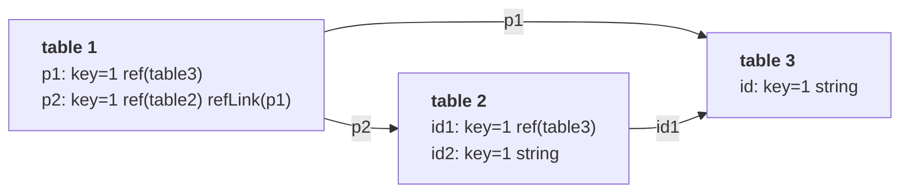

# Schema definition

A MOLGENIS [database](use_database.md) is defined by its schema. The schema enables rich data modelling using tables, columns and relationships.

You can create complete custom database schemas using the molgenis schema editor or by uploading a 'EMX2' schema file format. First create a sheet in Excel
named `molgenis`. Or create a molgenis.csv or molgenis.tsv sheet and upload it as part of a zip file. Note: you can upload the data in the same file as well.
For that make sure each Excel sheet or .tsv/.csv file is named in your molgenis metadata sheet.

## Example of a 'molgenis' schema

| tableName | columName | type | key | required | description               |
| --------- | --------- | ---- | --- | -------- | ------------------------- |
| Person    |           |      |     |          | my person table           |
| Person    | id        | int  | 1   |          | id is part of primary key |
| Person    | firstName |      | 2   |          |                           |
| Person    | lastName  |      | 2   |          |                           |

Note: combination of Person.firstName + Person.lastName is unique in table Person.

## Simple columns

You can describe basic columns using:

### tableName

Will be the name of the table. Must be unique per database (including present ontologies).

It must start with a letter, followed by zero or more letters, numbers, spaces or underscores. A space immediately before or after an underscore is not allowed. The character limit is 31 (so it fits in Excel sheet names).

Regular expression requirement: `^(?!.* _|.*_ )[a-zA-Z][a-zA-Z0-9 _]{0,30}$`  
See the [database naming requirements](./use_database.md#naming-requirements) for some examples (keep in mind a database name allows for `-` as well).

Settings defined on a line with the `tableName` without a `columnname` will apply to the table instead of a column.

### columnName

Will be the name of the column. Must be unique per tableName. Default value: empty

It must start with a letter, followed by zero or more letters, numbers, spaces or underscores. A space immediately before or after an underscore is not allowed. The character limit is 63 (PostgreSQL limit for identifiers before they get truncated).

Regular expression requirement: `^(?!.* _|.*_ )[a-zA-Z][a-zA-Z0-9 _]{0,62}$`  
See the [database naming requirements](./use_database.md#naming-requirements) for some examples (keep in mind a database name allows for `-` as well and has a lower character limit).

If a `columnName` contains spaces, it is escaped to camelCase for usage as variable.
For example, `first name` would be defined as `firstName` when creating a validation expression.

### columnType

Will be the type of column. Ignored if columnName is empty. See section on columnTypes below. Default value: string. MOLGENIS supports the following types (type
names are case insensitive):

Basic type:

- string : default when no type is provided
- bool
- int
- bigint
- decimal
- date
- datetime
- period : string as a ISO 8601 duration containing Years, Months and/or Days. (P2Y4M30D)
- uuid
- json : validates json format (must be an array or object!)
- file
- text : string that displays as text area

Special types:

- auto_id: will be set to an automatically assigned value. Use in combination with key=1 for autommatic primary key. Use in combination with 'computed' to add
  pre/postfix to your auto_id.
- email: string that displays as email link
- hyperlink: string that displays as url link

Relationships:

- ref : foreign key (aka many to one)
  - ontology: is a ref that is rendered as ontology tree (if refTable has 'parent'). In case of ontology, the refTable is automatically generated.
- ref_array : multiple foreign key (aka many to many).
  - ontology_array: is ref_array that is rendered as ontology tree (if refTable has 'parent'). In case of ontology, the refTable is automatically generated.
- refback : to describe link back to ref/ref_array (aka one_to_many/many_to_many)

Arrays (i.e. list of values)

- string_array
- bool_array
- int_array
- bigint_array
- decimal_array
- date_array
- datetime_array
- period_array
- jsonb_array
- uuid_array
- text_array
- email_array
- hyperlink_array

Layout (static content, not an input):

- heading: will show the 'name' of your column as header, and optionally description below. Can be used to partition your forms/reports.

### key

Will indicate that a column is part of a key. Ignored if columnName is empty. Key means values in this column should be unique within the table. When key=1 this
is used as the primary key in the user interface, upload and API. Other key>1 can be used to create a secondary key. Default value: empty

### required

When required=TRUE then values in this column must be filled. When required=FALSE then this column can be left empty. Default value: FALSE.

Besides TRUE and FALSE, it is also possible to provide a JavaScript expression using conditional logic based on the values of other columns.

For instance, consider a table with 'name' and 'surname' fields. If the 'name' field is provided, the 'surname' field should also be populated. The expression for the surname field could look like:
`if(name!=null) 'Surname should be provided when name is not null'`

The string after the expression is the validation message returned when the expression yields `true`, and the field is not provided.

It's also possible to use an expression without an error message:
`name != null`.
Will return the expression as an error message.

Expressions can also reference multiple fields. For example, consider a 'pet' table with the following fields:

- `species` (string)
- `onMedication` (bool)
- `age` (int)
- `weight` (decimal)
- `medicalStatus` (string)

The following expression would make 'medicalStatus' required if a cat is old, heavy, and on medication:
`if(onMedication && age > 10 && weight > 3 && species === 'cat')
'Medical status should be provided when an old fat cat is on drugs'`

### defaultValue

Using 'defaultValue' you can set a default value for a column. In forms, this value will be pre-filled.
When uploading csv/excel all empty cells will receive the defaultValue (in insert and update)
Optionally you can also use javascript expressions. For example:

- `duck` would set a string value
- `1` would set a numeric value
- `=new Date().toISOString()` provides automatic date/dateTime
- `={name:"green"}` could be default value for an ontology\_
- `=[{name:"green"}]` could be default value for an ontology_array

Known limitation: doesn't work for columns refering to a table with composite primary key (i.e. having multiple key=1 fields).

### semantics

Adding semantics to columns allows the data to be better represented when being used through semantic web tools (such as with the RDF API).

There are 2 formats allowed for this field:
* an IRI surrounded by `<` and `>` (f.e. `<http://purl.org/dc/elements/1.1/title>`)
* a prefixed name using a defined prefix followed by the relative IRI (f.e. `dcterms:title` if `dcterms` has been defined)

By default, the following prefixed names are available:
<!-- see: https://github.com/molgenis/molgenis-emx2/blob/master/backend/molgenis-emx2-rdf/src/main/java/org/molgenis/emx2/rdf/DefaultNamespace.java -->
<!-- regex-from: ^.*\("([\w\-]+)", "([\d\w:\/\.\-\#]+)".*$ -->
<!-- regex-to: | $1 | $2 | -->

| prefix        | IRI                                            |
|---------------|------------------------------------------------|
| afr           | http://purl.allotrope.org/ontologies/result#   |
| afrl          | http://purl.allotrope.org/ontologies/role#     |
| dc            | http://purl.org/dc/elements/1.1/               |
| dcat          | http://www.w3.org/ns/dcat#                     |
| dcterms       | http://purl.org/dc/terms/                      |
| edam          | http://edamontology.org/                       |
| efo           | http://www.ebi.ac.uk/efo/                      |
| ejp           | https://w3id.org/ejp-rd/vocabulary#            |
| ensembl       | http://ensembl.org/glossary/                   |
| fdp-o         | http://w3id.org/fdp/fdp-o#                     |
| fg            | https://w3id.org/fair-genomes/resource/        |
| foaf          | http://xmlns.com/foaf/0.1/                     |
| healthDCAT-AP | urn:uuid:a7ef52b2-bd43-4294-a80f-3e7299af35e4# |
| hl7           | http://purl.bioontology.org/ontology/HL7/      |
| ldp           | http://www.w3.org/ns/ldp#                      |
| lnc           | http://purl.bioontology.org/ontology/LNC/      |
| mesh          | http://purl.bioontology.org/ontology/MESH/     |
| obo           | http://purl.obolibrary.org/obo/                |
| odrl          | http://www.w3.org/ns/odrl/2/                   |
| ordo          | http://www.orpha.net/ORDO/                     |
| org           | http://www.w3.org/ns/org#                      |
| owl           | http://www.w3.org/2002/07/owl#                 |
| prov          | http://www.w3.org/ns/prov#                     |
| qb            | http://purl.org/linked-data/cube#              |
| rdf           | http://www.w3.org/1999/02/22-rdf-syntax-ns#    |
| rdfs          | http://www.w3.org/2000/01/rdf-schema#          |
| schema        | http://schema.org/                             |
| sio           | http://semanticscience.org/resource/           |
| skos          | http://www.w3.org/2004/02/skos/core#           |
| snomedct      | http://purl.bioontology.org/ontology/SNOMEDCT/ |
| vcard         | http://www.w3.org/2006/vcard/ns#               |
| xsd           | http://www.w3.org/2001/XMLSchema#              |

!> The IRI for healthDCAT-AP is a placeholder as it [currently does not have one defined](https://healthdcat-ap.github.io/#namespaces).

!> The list above can be overridden using a [schema-specific advanced setting](./dev_rdf.md#semantic_prefixes).

### label,label:en,label:fr etc

Using label you can change the labels in forms. Typically useful for data capture and surveys. Using :suffix you can give labels for multiple languages, e.g.
label:fr is for the french language. The shorthand 'label' is synonymous to 'label:en'.

N.B. to enable localized labels you must change database setting 'locale' to value `["en","fr","de"]` from default
`["en"]` (use the locales you want to define in your models, we recommend to use the ISO language codes);

### description

Text value that describes the column, or when columnName is empty, the table.

## Cross-references

You can define cross-references from one table to another using columnType=ref (single reference) or columnType=ref_array (multiple references). In postgresql
these translate to foreign keys, and array of foreign key with triggers protecting foreign key constraints respectively. You need to define refTable.

### refTable

This metadata is used to define relationships between tables. When columnType is 'ref' or 'ref_array' then you must provide refTable. In simple cases, this is
all you need. The value of refTable should a defined tableName. N.B. if your columnType is not of a 'ref' than having refTable will produce an error. Default value: empty

A simple reference:

| tableName | columName | type | key | refTable | required | description               |
| --------- | --------- | ---- | --- | -------- | -------- | ------------------------- |
| Person    |           |      |     |          |          | my person table           |
| Person    | id        | int  | 1   |          |          | id is part of primary key |
| Person    | firstName |      | 2   |          | TRUE     |                           |
| Person    | lastName  |      | 2   |          | TRUE     |                           |
| Pet       | name      |      | 1   |          |          |                           |
| Pet       | species   |      |     |          | TRUE     |                           |
| Pet       | owner     | ref  |     | Person   | TRUE     | foreign key to Person     |

Note: when key=1 then automatically required=TRUE

### refBack

If you want to create a two-directional relationship, you can use columnType=refback + refBack=aColumnName. The refBack should then refer to a column in
refTable that is of columnType=ref or columnType=ref_array and refers to this table. A refback column behaves as a ref_array, but is in fact either many_to_many
or many_to_one, depending on whether the refback is ref or ref_array. Refback columns are read-only (i.e. you cannot insert/update data in these columns). See
the example below.

### refLink

!> This functionality is currently not configurable through the web interface.

When dealing with a design where a composite key indirectly refers to the same table through multiple layers,
one can use `refLink` to simplify the data processing. This way, complex duplicate mentioning of the same "final table"
is unneeded and only the additional primary keys still need to be mentioned for the in-between tables.

For example, imagine the following schema with 3 tables:

Here, we have table 1 that has a composite key that refers to both table 2 and table 3.
As table 2 also has a composite key with a reference to table 3, table 1 indirectly refers to table 3 twice.
Therefore, `p2` in table1 can set a `refLink(p1)` to indicate parts of table 2 are identical to `p1` from table 1.
This way, only `id2` from table 2 needs to be specified during data processing.
Note that table 2 requires a non-ref column for this to function properly.

For a data export, table 2 and table 3 stay identical no matter if a `refLink` is used. However, table 1 will be simplified by using a `refLink`, as explained in the table below:

| column | without refLink | with refLink | explanation                                                                  | 
|--------|-----------------|--------------|------------------------------------------------------------------------------|
| p1     | p1              | p1           | stays identical                                                              |
| p2     | p2.id1          |              | refLink makes this unnecessary                                                |
| p2     | p2.id2          | p2           | column name can be simplified as only 1 remaining column needs to be defined |


?> Want to try out the example above? Download it [here](https://github.com/molgenis/molgenis-emx2/raw/master/docs/resources/reflink_example1739203151994.zip) and upload it to a database without a schema.

## Ontologies

Schema allows for some magic for columns of type 'ontology' and 'ontology_array'. For these columns, the referred table is automatically created, using refTable
as the name.

The ontology table minimaly needs the following content

| name  |
| ----- |
| term1 |
| term2 |

A more advanced example

| name    | parent | label | description                           | ontologyURI |
| ------- | ------ | ----- | ------------------------------------- | ----------- |
| term1   |        |       |                                       |             |
| term1.a | term1  |       |                                       |             |
| term1.b | term1  | b     | this will show 'b' instead of term1.b |

Explanation:

- parent - will show terms in a hierarchy
- label - Note that by default the 'label' will be same a name. However in user interface tree input it can be desirable to show another label.
- ontologyTermURI - hyperlink to persistent identifier
- order - use this to change the order, otherwise insertion order will be used

## Expressions

You can further fine tune the behavior of tables using molgenis expressions.

### Helper functions

Expressions can use a helper function `simplePostClient(query: string, variables: object, schemaId?: string)` to do a blocking GraphQL request. Providing a GraphQL query, variables and a optional schemaId the function will return the requested data in json format. Please use sparingly, this may slowdown interface reactivity.

Example usage of `simplePostClient` as a default value expression.

```
=(function () {

  let result = simplePostClient(
    `query Visits_synostosis( $filter:Visits_synostosisFilter, $orderby:Visits_synostosisorderby ) { Visits_synostosis( filter:$filter, limit:20, offset:0, orderby:$orderby ) { suture {name, label} mg_insertedOn }}`,
    {
      filter: { belongsToSubject: { equals: [{ id: belongsToSubject.id }] } },
      orderby: { mg_insertedOn: "ASC" },
    }
  );

  return {
    name: result?.Visits_synostosis[0]?.suture?.name,
  };

})()
```

### computed

Enables you to compute a value. Computed values are computed before a record is inserted/updated. The computedColumn must contain valid javascript returning the
value. All columns of the table are available as variable. Computed values are read-only in the user interface.

For example:

| tableName | columnName | key | computed                  |
| --------- | ---------- | --- | ------------------------- |
| parts     | id         | 1   | productNo + "\_" + partNo |
| parts     | productNo  | 2   |                           |
| parts     | partNo     | 2   |                           |

#### in combination with type=AUTO_ID

In combination with data type AUTO_ID this will generate an value for a column by using the special ${mg_autoid} token in the computed expression. For example:

For example:

| tableName | columnName | key | type    | computed             |
| --------- | ---------- | --- | ------- | -------------------- |
| parts     | id         | 1   | AUTO_ID | foo-${mg_autoid}-bar |

Auto id with pre and post fix `foo-${mg_autoid}-bar'` would result in something like `foo-ae6e3b15-c9e2-4d16-8ab3-5984ba64ce09-bar`

### validation expression, visible expression

Validation expressions and visible expressions are used to fine tune forms. Validation expressions must be valid javascript.

Validation expressions must return either null or true. Otherwise they will show an error message and prevent insert/update. In case of 'false' the visible
expression itself is shown. Otherwise, the return value of the expression will be shown. For example:

| validation                                                                 | message                                                                           |
| -------------------------------------------------------------------------- | --------------------------------------------------------------------------------- |
| `price > 1`                                                                | Application of validation rule failed: price > 1                                  |
| `if(price<=1)'price should be larger than 1'`                              | Application of validation rule failed: price should be larger than 1              |
| `/^([a-z]+)$/.test(name)`                                                  | Application of validation rule failed: /^([a-z]+)$/.test(name)                    |
| `if(!/^([a-z]+)$/.test(name))'name should contain only lowercase letters'` | Application of validation rule failed: name should contain only lowercase letters |

Special attention needs to be paid when validating if a field is empty or not (as filled in fields that get emptied are different from never filled in fields).
While [required](#required) should be used to ensure a field itself is filled, when creating expressions (that include other fields), use the following:

| validation               | functioning                       |
|--------------------------|-----------------------------------|
| `columnName?.length > 0` | Field 'columnName' must be filled |
| `!(columnName?.length)`  | Field 'columnName' must be empty  |

Visible expressions must return a value that is not false or undefined, otherwise the column stays hidden in the user interface. In the event that javascript
throws an exception, this is shown in user interface/error message. For example:

| visible                                   | description                                                      |
| ----------------------------------------- | ---------------------------------------------------------------- |
| `pets?.some(pet => pet.name === 'pooky')` | will only be shown when 'pooky' was selected in 'pets' ref_array |

## Table inheritance

You can reuse table definitions, and make more specialized tables using 'tableExtends'.

### tableExtends

Should contain the value of an existing tableName. When providing tableExtends, the column with 'columnName' should be empty. It means the columns defined in
that tableName will be added to this table. In addition, rows added to this table, will also be visible in the table that is extended.

## molgenis_ontologies

## Cross schema references/extends

Usually it is good practice to keep all tables you work with in one schema, so you can upload/download them as a unit. However, there might be cases where you
want to refer to data in other schemas. For example, large reference sets, or a situation in which you have multiple organizations contributing data. For these
cases you can use 'refSchema'.

### refSchema

Using meta data 'refSchema' you can indicate that a refTable or tableExtends should look into other schema. In addition, binding to a particular schema greatly
limits flexibility of the data structure. An additional requirement is that the table from the other schema should not have a name conflict with any table in
the current schema. This is because in practice, the table from the other schema will be imported into the current schema.

### refLabel

Using 'refLabel' you can change the way on how a reference is being shown on the screen. By default the key=1 fields of the refTable are used. Caveat: you
should make sure that the refLabel is unique and not null and only uses fields that are part of a key. To make sure, we recommend you make the fields required 
and part of a secondary key, or that you use 'computed' to produce you ref_label as a key=x field.

Example:

| tableName | columnName | type | key | required | refTable | refLabel                 |
| --------- | ---------- | ---- | --- |----------|----------|--------------------------|
| person    | id         |      | 1   | true     |          |                          |
| person    | firstName  |      | 2   | true     |          |                          |
| person    | lastName   |      | 2   | true     |          |                          |
| person    | mother     | ref  |     |          | Person   | ${firstName} ${lastName} |

## Simple migrations

An advanced use case is if you want to use the molgenis.csv upload for simple migrations such as to rename or drop tables and/or columns in batch.
This functionality is also available in GraphQL (and is used by the schema editor app)

To use migrations you can annotate your molgenis.csv with

- oldName - will be used to rename columns or tables
- drop - will mark tables or columns to be deleted.

For example

| tableName | columnName | oldName  | drop |
| --------- | ---------- | -------- | ---- |
| newTable  |            | oldTable |      |
| newName   | columnB    | columnA  |      |
| newName   | columnC    |          | true |
| tableC    |            |          | true |

Will respectively

- rename oldName to newName
- rename columnA to columnB (even if it was in table oldTable)
- drop columnC
  - drop TableC

## Changelog

Data changes made by a user can be tracked via a changelog. When enabled, all (data) changes made by a user are stored in a changelog table. The changelog can
only be enabled or disabled for the entire schema. Admin or Manager users can view changes made by going to `[server]/[schema]/settings/#/changelog` ( Settings
app -> select the 'Changelog' tab).

The changelog can be enabled after schema creation via adding a setting with key `isChangelogEnabled`, and setting the value to `true`. Disabling the changelog
is done the setting the value to `false` or removing the setting
