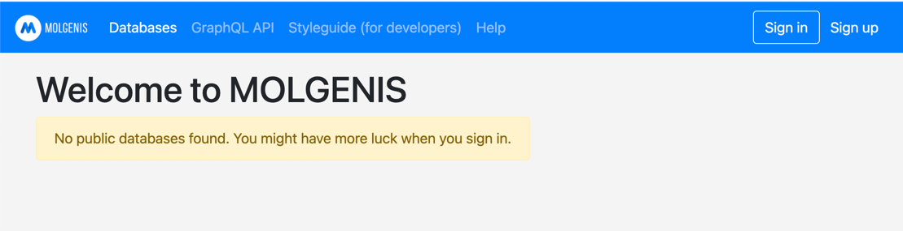
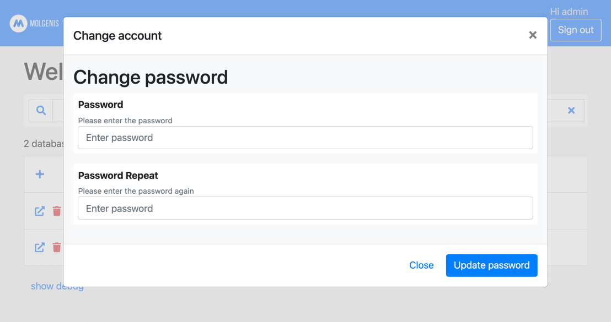
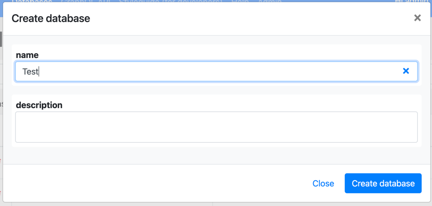
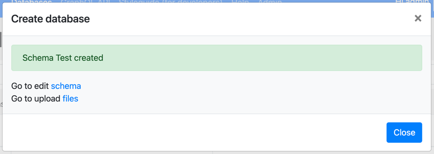
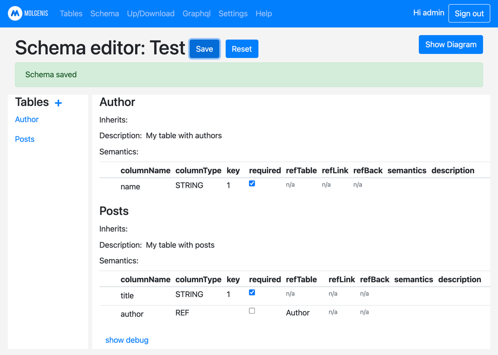
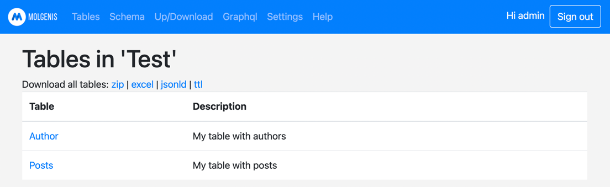
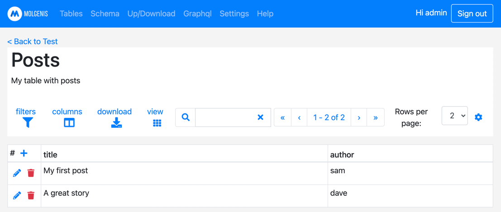
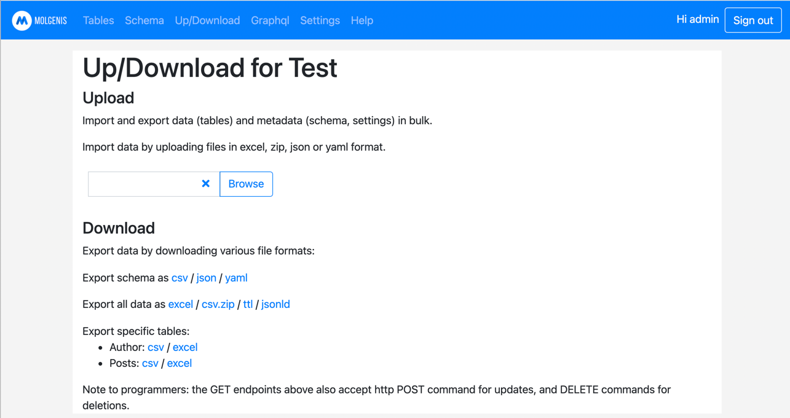
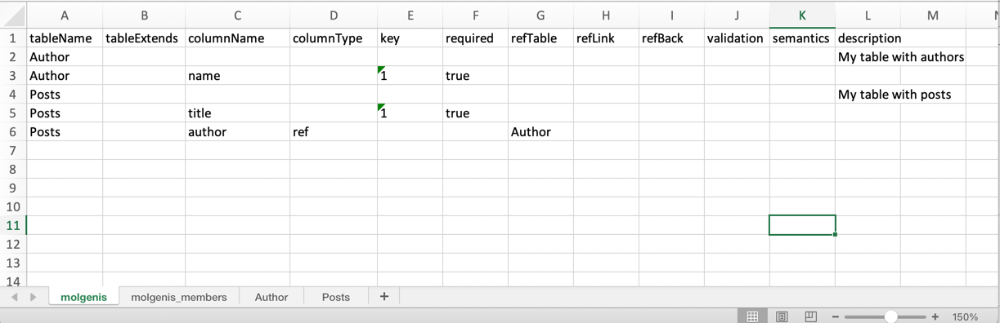
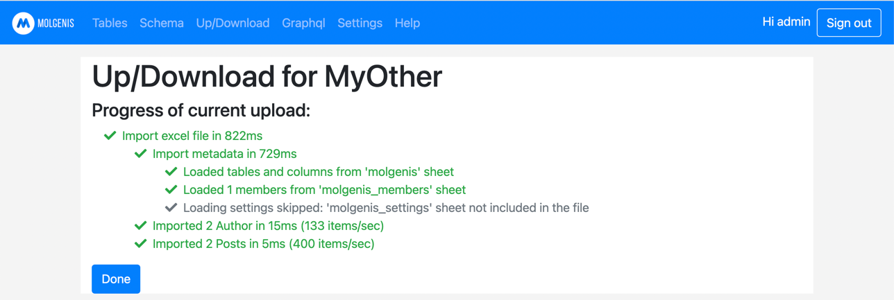

# Getting started with empty MOLGENIS

MOLGENIS enables you to quickly create databases, batteries included. This guide explains how to get started. We assume
you just installed MOLGENIS (see installation guide).

## 1. Log in as admin

After you start MOLGENIS you will see the screen below. You can "sign in" using the button at the top right, choosing username 'admin'
and password 'admin'.

## 2. Change admin password

The first thing to do is to change the admin password. Therefore you can click your username in the menu bar at the top, which
currently should be 'Hi admin' and then you can change the password.

## 3. Browse databases

MOLGENIS comes with a 'pet store' example database. You can browse it to see what it looks like. And you can always
click the [molgenis] logo to come back to this screen.

## 3. Create database

MOLGENIS enables you to create databases. Two databases already exist: (1) an example database called 'pet store' and (2) a
database with System settings. Click the blue [+] icon at the top left of the list of databases.

## 4. Go to schema

Once a database is created, MOLGENIS enables you to configure it. You can do this using the 'schema' editor, or by
uploading a previously configured 'emx2' file (which is a great way to share best practices). We will go to 'edit schema'.

## 5. Edit schema

MOLGENIS' power is a complete freedom of data model, consisting of tables and columns. You can use the [+] to create new
tables, and you can use the [pencil] symbol to edit.

## 6. Create tables

Important notes:

- each table should have a unique name
- each table should have at least one column
- each table should have a primary key, which you indicate by setting the key column to '1'
- tables can be linked via a column of type 'REF' or 'REF_ARRAY' (i.e. foreign key)

Enter the example below and click 'save' to create your schema.

## 7. View tables data

Go to 'tables' in the main menu bar to see your tables.

## 8. Enter data

Click on the name of a table to view its contents. The result might look like this.

## 9. Download your data + schema

You might want to learn how to upload/download data. For this go to upload/download on the main menu. Then you can download
all, or subsets of, your data (i.e. table contents) and metadata (i.e. schema) in various formats.

## 10. View Excel download

Click 'Export all data as excel' and open the file. You will see that both your data (contents of Authors and Posts)
and metadata (table and column definitions) is included.

## 11. Upload in new schema

You can upload these contents into a new database, to create a 'clone' of your database. Therefore create a new
database (see above) and then go to 'upload files' for your new database and browse to the file you just downloaded.
Press 'import'.

This completes the 'getting started guide'. Go to view EMX2 reference to learn full details of data modelling.

